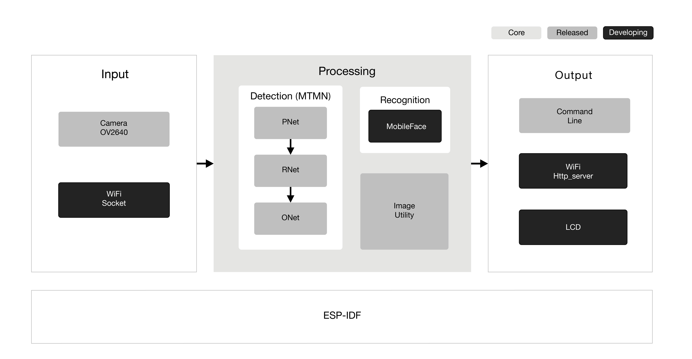

# ESP-WHO

ESP-WHO is a face detection and recognition platform that is currently based on Espressif Systems' [ESP32](https://espressif.com/en/products/hardware/esp32/overview) chip.

# Overview
ESP-WHO supports development of face detection and recognition applications based around Espressif Systems' [ESP32](https://espressif.com/en/products/hardware/esp32/overview) chip in the most convenient way. With ESP-WHO, you can easily build up face detection- and recognition-featured applications, for instance:
* A coffee machine that brews coffee according to your taste preference;
* Home applicance that will shut off the electricity automatically when unsupervised children are operating them;
* And other more applications that suit your needs.

In general, the ESP-WHO features will be supported as shown below:



In ESP-WHO, Detection, Recognition and Image Utility are at the core of the platform.


* **Image Utility** offers fundamental image processing APIs.

* **Detection** takes images as input and give the position of face if there is a face. It is implemented with MTMN model, which refers to [MTCNN](http://cn.arxiv.org/abs/1604.02878) and [MobileNets](https://arxiv.org/abs/1801.04381).

* **Recognition** is to identify the particular person, and it needs the results of detection. It is implemented with MobileFace model.

* **Optimization** is mainly to increase the precision of the inference, and to accelerate the whole process. But also it might change the structure of the network, update the coefficients, refactor the code, etc.

Both input and output are flexible.

* Image sources could be **input** via camera. However, we don't provide many drivers right now, those for other camera modules will be released in the future.

* Results could be **output** and displayed through Command line, LCD or even website via Wi-Fi http service.


# Quick Start with ESP-WHO

## Hardware Preparation

To run ESP-WHO, you need to have a development board which integrates a **ESP32 module** that has sufficient GPIO pins and more than **4 MB** external SPI RAM. Either [ESP-WROVER-KIT](https://www.espressif.com/en/products/hardware/esp-wrover-kit/overview) or [ESP-EYE](https://www.espressif.com/en/products/hardware/esp-eye/overview) can be a good choice as the test board.

On how to configure ESP32 module for your applications, please refer to the README.md of each example.

## Software Preparation

### Image

The recommended resolution of input image is **QVGA (320x240)**.

As for choosing camera as an image offer, make sure that the ESP32 module you choose offers specific pins that your camera needs.

By now, we have provided the driver of **OV2640** and **OV3660**, which are highly recommended to get started with.

### ESP-WHO
Make sure you clone the project recursive:

```
git clone --recursive https://github.com/espressif/esp-who.git 
```

If you clone project without `--recursive` flag, please go to the `esp-who` directory and run command `git submodule update --init` before doing anything.

### ESP-IDF
See setup guides for detailed instructions to set up the ESP-IDF:

* [Getting Started Guide for ESP-IDF v4.0](https://docs.espressif.com/projects/esp-idf/en/v4.0/get-started/index.html)

 In this case, we take [ESP-IDF v4.0](https://github.com/espressif/esp-idf/tree/release/v4.0) as the default version.

 If you have already configured ESP-IDF before and don't want to change the existing one, you can just point `IDF_PATH` to the ESP-IDF that is in ESP-WHO.


# Components

Components is the main framework of the SDK, with some drivers and algorithm inside.

## Camera

The [camera](https://github.com/espressif/esp32-camera/tree/master) component contains drivers for camera devices of ESP32.


## esp-face

The [esp-face](https://github.com/espressif/esp-face/tree/master) component contains the APIs of ESP-WHO neural networks, including face detection and recognition framework.


# Examples
The folder of [examples](examples) contains sample applications demonstrating the API features of ESP-WHO.

Take one Face Detection as an example.

1. Get into one example folder `esp-who/examples/single_chip/detection_with_command_line`.
```
cd esp-who/examples/single_chip/detection_with_command_line
```

2. Compile and flash the project.
```
idf.py build
idf.py flash -p [PORT]
```
3. Advanced users can modify some options by using the command `idf.py menuconfig`.


Check README.md of each example for more details.


# Resources

* [Check the Issues section on github](https://github.com/espressif/esp-who/issues) if you find a bug or have a feature request, please check existing Issues before opening a new one.

* If you're interested in contributing to ESP-WHO, please check the [Contributions Guide](https://esp-idf.readthedocs.io/en/latest/contribute/index.html).
