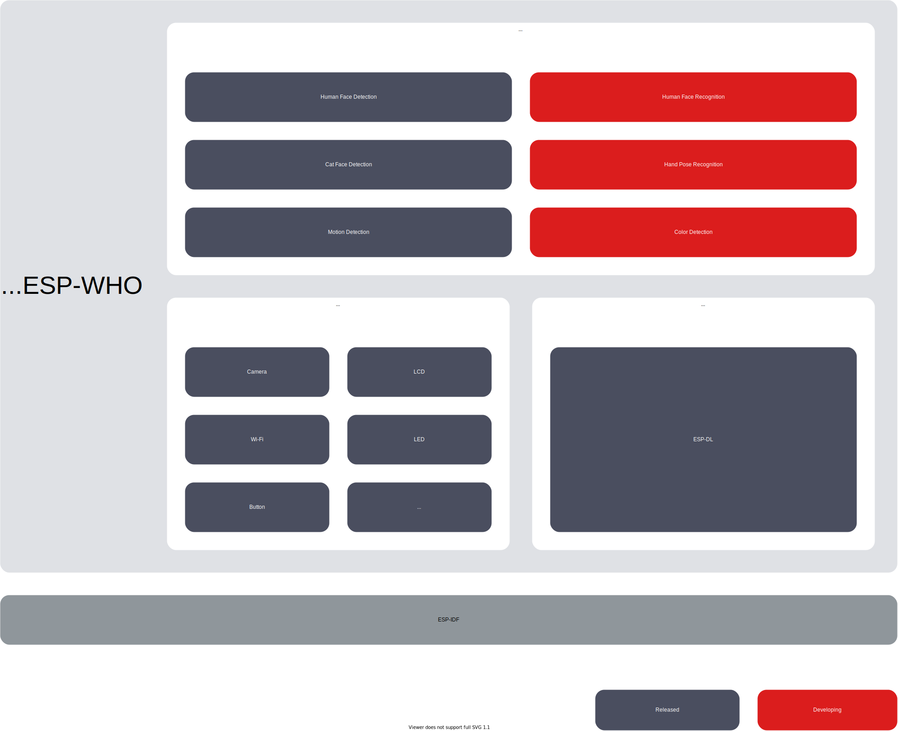
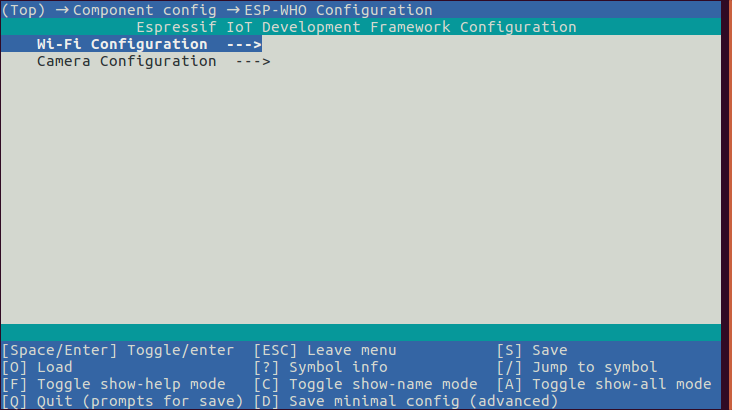
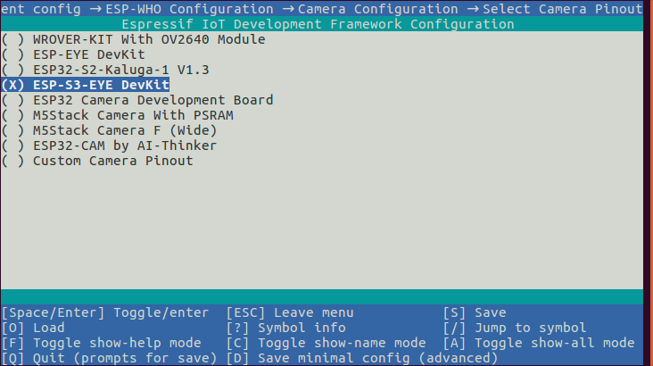
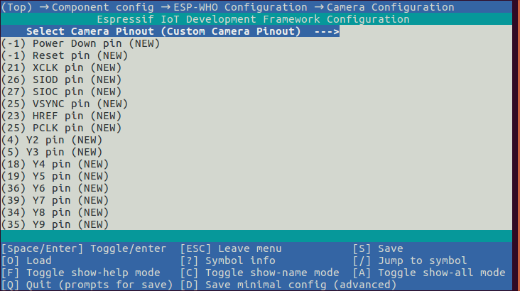
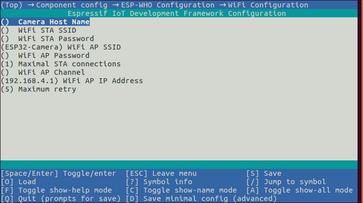

# ESP-WHO [[中文]](./README_CN.md)

ESP-WHO is an image processing development platform based on Espressif chips. It contains development examples that may be applied in practical applications.

## Overview

ESP-WHO provides examples such as Human Face Detection, Human Face Recognition, Cat Face Detection, Gesture Recognition, etc. You can develop a variety of practical applications based on these examples. ESP-WHO runs on ESP-IDF. [ESP-DL](https://github.com/espressif/esp-dl) provides rich deep learning related interfaces for ESP-WHO, which can be implemented with various peripherals to realize many interesting applications.

<p align="center">
     
</p>


## What You Need

### Hardware

We recommend novice developers to use the development boards designed by Espressif. The examples provided by ESP-WHO are developed based on the following Espressif development board, and the corresponding relationships between the development boards and SoC are shown in the table below.
    
|    SoC    | [ESP32](https://www.espressif.com/en/products/socs/esp32) | [ESP32-S2](https://www.espressif.com/en/products/socs/esp32-s2) | [ESP32-S3](https://www.espressif.com/en/products/socs/esp32-s3) |
| :------- | :----------------------------------------------------------: | :----------------------------------------------------------: | :----------------------------------------------------------: |
| Development Board | [ESP-EYE](https://www.espressif.com/en/products/devkits/esp-eye/overview) | [ESP32-S2-Kaluga-1](https://docs.espressif.com/projects/esp-idf/en/latest/esp32s2/hw-reference/esp32s2/user-guide-esp32-s2-kaluga-1-kit.html) | [ESP-S3-EYE](https://www.espressif.com/en/products/devkits/esp-s3-eye/overview) |

> Using a development board not mentioned in the table above, configure pins assigned to peripherals manually, such as camera, LCD, and buttons.

### Software

#### Get ESP-IDF

ESP-WHO runs on ESP-IDF. For details on getting ESP-IDF, please refer to [ESP-IDF Programming Guide](https://idf.espressif.com/).

> Please use the latest ESP-IDF on the [release/v4.4](https://github.com/espressif/esp-idf/tree/release/v4.4) branch. If you are using ESP-IDF [release/v5.0](https://github.com/espressif/esp-idf/tree/release/v5.0) branch, please switch the ESP-WHO branch to the idfv5.0.

#### Get ESP-WHO

Run the following commands in your terminal to download ESP-WHO:

```bash
git clone --recursive https://github.com/espressif/esp-who.git
```

> Remember to use ``git submodule update --recursive --init`` to pull and update submodules of ESP-WHO.

## Run Examples

All examples of ESP-WHO are stored in [examples](./examples) folder. Structure of this folder is shown below:

```bash
├── examples
│   ├── cat_face_detection          // Cat Face Detection examples
│   │   ├── lcd                     // Output displayed on LCD screen
│   │   ├── web                     // Output displayed on web
│   │   └── terminal                // Output displayed on terminal
│   ├── code_recognition            // Barcode and QR Code Recognition examples
│   ├── human_face_detection        // Human Face Detection examples
│   │   ├── lcd
│   │   ├── web
│   │   └── terminal
│   ├── human_face_recognition      // Human Face Recognition examples
│   │   ├── lcd
│   │   ├── terminal
│   │   └── README.md               // Detailed description of examples
│   └── motion_detection            // Motion Detection examples
│       ├── lcd 
│       ├── web
│       ├── terminal
│       └── README.rst              
```

For the development boards mentioned in [Hardware](#Hardware), all examples are available out of the box. To run the examples, you only need to perform [Step 1: Set the target chip] (#Step-1 Set the target chip) and [Step 4: Launch and monitor] (#Step-4 Launch and monitor).

### Step 1: Set the target chip

Open the terminal and go to any folder that stores examples (e.g. examples/human_face_detection/lcd). Run the following command to set the target chip: 

```bash
idf.py set-target [SoC]
```

Replace [SoC] with your target chip, e.g. esp32, esp32s2, esp32s3.

**NOTE:** we implement examples of target chip `esp32s3` with ESP32-S3-EYE by defaults. So that `flash` and `monitor` are through USB. If you are using other board, please confirm which method you will use first,

- If by USB, just keep it in defaults,
- If by UART, set it in menuconfig.

### (Optional) Step 2: Configure the camera

If not using the Espressif development boards mentioned in [Hardware](#Hardware), configure the camera pins manually. Enter `idf.py menuconfig` in the terminal and click (Top) -> Component config -> ESP-WHO Configuration to enter the ESP-WHO configuration interface, as shown below:



Click Camera Configuration to select the pin configuration of the camera according to the development board you use, as shown in the following figure:



If the board you are using is not shown in the figure above, please select ``Custom Camera Pinout`` and configure the corresponding pins correctly, as shown in the following figure: 



### (Optional) Step 3: Configure the Wi-Fi

If the output of example is displayed on web server, click Wi-Fi Configuration to configure Wi-Fi password and other parameters, as shown in the following figure: 



### Step 4: Launch and monitor

Flash the program and launch IDF Monitor:

```bash
idf.py flash monitor
```


## Default Binaries of Development Boards

The default binaries for each development board are stored in the folder [default_bin](./default_bin). You can use Flash Download Tool (https://www.espressif.com/en/support/download/other-tools) to flash binaries.


## Feedback


Please submit an [issue](https://github.com/espressif/esp-who/issues) if you find any problems using our products, and we will reply as soon as possible.
