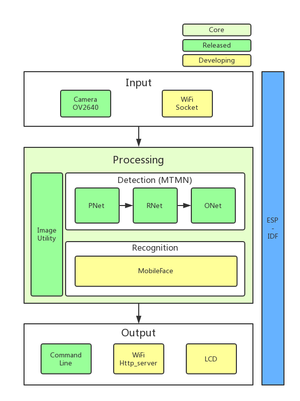

# ESP-WHO

ESP-WHO is a face detection and recognition platform that is currently based on Espressif Systems' [ESP32](https://espressif.com/en/products/hardware/esp32/overview) chip. ESP-WHO is within Espressif Systems AI framework, with the focus on face detection and recognition so far.

# Overview
ESP-WHO supports development of face detection and recognition applications based around Espressif Systems' [ESP32](https://espressif.com/en/products/hardware/esp32/overview) chip in the most convenient way. With ESP-WHO, you can easily build up face detection- and recognition-featured applications, for instance: 
* A coffee machine that brews coffee according to your taste preference via ESP-WHO;
* Home applicance that will shut off the electricity automatically if ESP-WHO recognizes that unsupervised children are operating them;
* And many more applications that suit your needs.

In general, the ESP-WHO features will be supported as shown below:

 

In ESP-WHO, Detection, Recognition and Image Utility are at the core of the platform.


* **Image Utility** offers the fundamental image processing API for ESP32.

* **Detection**, or MTMN, uses [MTCNN](http://cn.arxiv.org/abs/1604.02878) and [MobileNet](https://arxiv.org/abs/1801.04381) for reference. However, we replace CNN with MobileNet block and the model size is quite smaller than other face detection models. With special training schemes, MTMN could achieve good performance in detection in some applications scenarios.

* **Recognition** is implemented with MobileFace and will be released soon, accompanied with technique details.


Both input and output are flexible.

* Image sources could be **input** via camera, Wi-Fi socket and etc. However, we don't provide many drivers right now, but drivers for other camera modules, Wi-Fi socket and etc will be released very soon. 

* Results could be **output** and displayed on Command line, LCD or even website via Wi-Fi http_server.


# Quick Start with ESP-WHO

## Hardware Preparation

To run ESP-WHO, you need to have a development board that integrates a **ESP32 module** that has sufficient GPIO pins and more than **4 MB** external SPI RAM. In this case, we take **ESP-WROVER-KIT** as the test board, which is highly recommended for getting started with ESP-WHO. 

On how to select ESP32 module for your applications, please refer to the README.md of each example. 

## Software Preparation

### Image

The recommended resolution of input image is **320x240** in **RGB565** format.

As for choosing camera as an image offer, make sure that the ESP32 module you choose offers specific pins your camera needs. If there are pin conflicts, please refer to the pin connection in README.md of each example. 

By now, we have provided the driver of **OV2640**, which is highly recommended as an image offer to get started with. More camera drivers will be released later on.


### ESP-IDF
See setup guides for detailed instructions to set up the ESP-IDF:

* [Getting Started Guide for the stable ESP-IDF version](https://docs.espressif.com/projects/esp-idf/en/stable/get-started/)
* [Getting Started Guide for the latest (master branch) ESP-IDF version](https://docs.espressif.com/projects/esp-idf/en/latest/get-started/)

 In this case, we take [ESP-IDF v3.1](https://github.com/espressif/esp-idf/releases/v3.1) as the test version.


### ESP-WHO
Make sure you clone the project recursive:

```
git clone --recursive https://github.com/espressif/esp-who.git 
```

 If you clone project without `--recursive` flag, please go to the `esp-who` directory and run command `git submodule update --init` before doing anything.


# Components

Components such as camera drivers, image utility, face detection and etc are stored in [components](components) folder.

See the following sections for more details about components.

## Camera

The [camera](components/camera) component contains drivers for camera devices of ESP32. Now OV2640 is supported. 

## Image_util

The [image_util](components/image_util) component is designed for fundamental image processing of ESP32. Resizing and transforming are the major operations in ESP-WHO.  

## esp_facenet

The [esp_facenet](components/esp_facenet) component contains the APIs of ESP-WHO neural networks. Only face detection is released by now. 

- [esp_facenet/mtmn](components/esp_facenet/mtmn): The neural network of MTMN is stored in this folder. Codes in [mtmn.c](components/esp_facenet/mtmn/mtmn.c) file provide detailed implementations of **P-Net**, **R-Net** and **O-Net** and offer the APIs.
- [esp_facenet/face_detection](components/esp_facenet/face_detection):
The face detection implementation is stored in this folder. Codes in [face_detection.c](components/esp_facenet/face_detection/face_detection.c) call net implementation APIs of [mtmn](components/esp_facenet/mtmn/mtmn.c) and also with some process such as [nms](https://en.wikipedia.org/wiki/Canny_edge_detector#Non-maximum_suppression) to implement face detection.

Face Recognition of ESP-WHO will be stored in here as well.

# Examples
The folder of [examples](examples) contains sample applications demonstrating the API features of ESP-WHO.

Take one Face Detection as an example. 

1. Get into one example folder `esp-who/examples/single_chip/camera_with_command_line`. 
```
cd esp-who/examples/single_chip/camera_with_command_line 
```

2. Compile with the latest [ESP-IDF](https://github.com/espressif/esp-idf). You may run `make defconfig` before `make flash` to get the default configurations. 
```
make defconfig
make flash
```
3. Advanced users can modify some options by using the command `make menuconfig`.


Check README.md of each example for more details.


# Resources

* [Check the Issues section on github](https://github.com/espressif/esp-who/issues) if you find a bug or have a feature request, please check existing Issues before opening a new one.

* If you're interested in contributing to ESP-WHO, please check the [Contributions Guide](https://esp-idf.readthedocs.io/en/latest/contribute/index.html).
