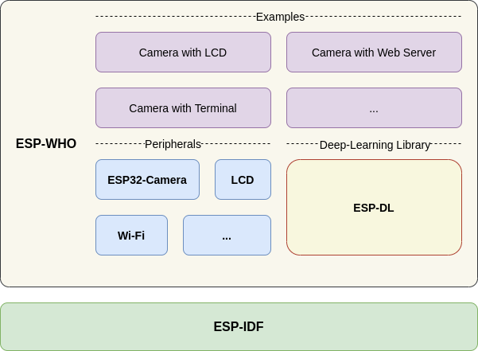
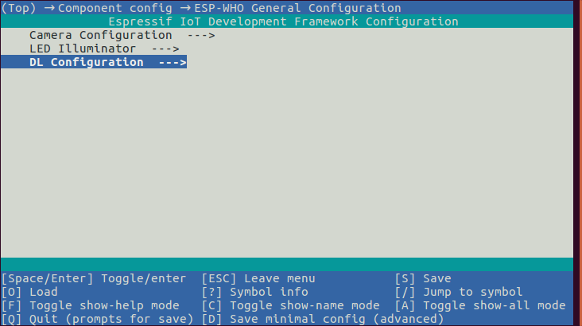
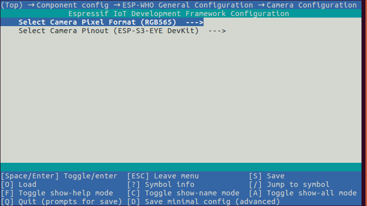
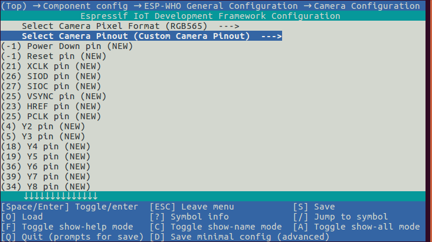
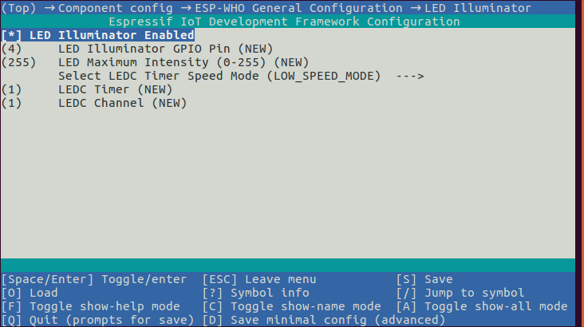
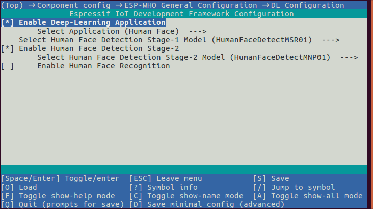
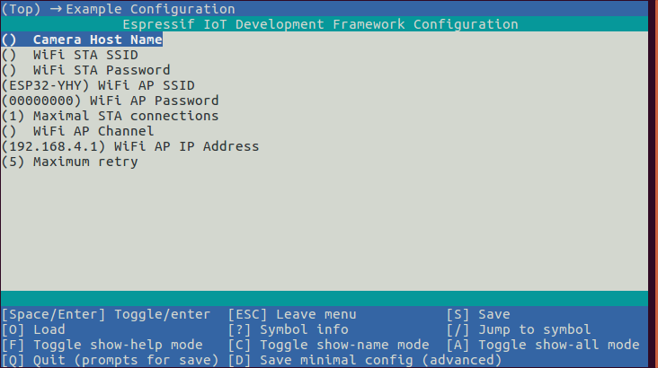

##################################################################################
ESP-WHO
##################################################################################

ESP-WHO 是基于乐鑫芯片的图像处理开发平台。其中包含了实际应用中可能出现的开发示例。

概述
====================================================================================================

ESP-WHO 提供了例如人脸检测、人脸识别、猫脸检测和手势识别等示例。您可以基于这些示例，衍生出丰富的实际应用。
ESP-WHO 的运行基于 ESP-IDF。`ESP-DL <https://github.com/espressif/esp-dl>`_ 为 ESP-WHO 提供了丰富的深度学习接口。
配合各种外设可以实现许多有趣的应用。

    
    ..

准备工作
====================================================================================================

硬件
--------------------------------------------------------------------------------------

按照所有示例的一般流程，可将硬件准备分为三个部分：

+ 摄像头模块： ESP-WHO 中的所有示例用到的摄像头驱动均来自 `ESP32-Camera <https://github.com/espressif/esp32-camera>`_ ，您可从中挑选摄像头型号；您也可以选择其他摄像头，只是需要自行支持驱动。

+ 处理单元： ESP32，ESP32-S2，ESP32-S3 中的任意一款。

+ 显示方式： LCD 等。

对于新手，我们还提供了开发套件 `ESP-WROVER-KIT <https://www.espressif.com/zh-hans/products/hardware/esp-wrover-kit/overview>`_ ，`ESP-EYE <https://www.espressif.com/zh-hans/products/devkits/esp-eye/overview>`_ ，`ESP-S3-EYE <https://www.espressif.com/zh-hans/products/devkits/esp-eye/overview>`_ ，他们的概况如下：

+----------------+----------+------------------+------------------+
| 开发板名称     | 芯片型号 |    摄像头型号    |     显示方式     |
|                |          |                  +------+-----+-----+
|                |          |                  | 终端 | Web | LCD |
+----------------+----------+------------------+------+-----+-----+
|   ESP-EYE      |   ESP32  | OV2640 或 OV3660 |   Y  |  Y  |  N  |
+----------------+----------+------------------+------+-----+-----+
| ESP-S3-EYE     | ESP32-S3 | OV2640 或 OV3660 |   Y  |  Y  |  Y  |
+----------------+----------+------------------+------+-----+-----+
| ESP-WROVER-KIT | ESP32    | OV2640 或 OV3660 |   Y  |  Y  |  N  |
+----------------+----------+------------------+------+-----+-----+

软件
--------------------------------------------------------------------------------------

获取 ESP-IDF
^^^^^^^^^^^^^^^^^^^^^^^^^^^^^^^^^^^^^^^^^^^^^^^^^^^^^^^^^^^^^^^^^^^^^^^^^^^^^^^^^^^^^^

ESP-WHO 的运行基于 ESP-IDF。关于获取 ESP-IDF 的细节，请参考 `ESP-IDF 编程指南 <https://idf.espressif.com/>`_ 。

.. attention:: 请使用最新的 esp-idf/master 分支。

获取 ESP-WHO
^^^^^^^^^^^^^^^^^^^^^^^^^^^^^^^^^^^^^^^^^^^^^^^^^^^^^^^^^^^^^^^^^^^^^^^^^^^^^^^^^^^^^^

.. code:: shell

    git clone --recursive https://github.com/espressif/esp-who.git

.. attention:: 不要忘记 ``--recursive`` 拉取 ESP-WHO 的所有 submodule

    可以通过 ``git submodule update --init`` 拉取和更新 submodule

运行示例
====================================================================================================

示例对开发套件的支持情况如下表所示：

+------------------------+---------------------------------------+
|        示例名称        |              支持的开发板             |
|                        +---------+------------+----------------+
|                        | ESP-EYE | ESP-S3-EYE | ESP-WROVER-KIT |
+------------------------+---------+------------+----------------+
|  Camera with Terminal  |    Y    |      Y     |        Y       |
+------------------------+---------+------------+----------------+
| Camera with Web Server |    Y    |      Y     |        Y       |
+------------------------+---------+------------+----------------+
|     Camera with LCD    |    N    |      Y     |        N       |
+------------------------+---------+------------+----------------+

步骤1：设定目标芯片
--------------------------------------------------------------------------------------

打开终端，进入一个您想运行的示例，设定目标芯片。

.. code:: shell

    idf.py set-target [SoC]

将 [SoC] 替换成您的 目标芯片, 例如 esp32，esp32s2，esp32s3。

步骤2：通用配置
--------------------------------------------------------------------------------------

通用配置指的是每个示例都会涉及到的配置，例如，摄像头配置、模型选择等。
您可以通过 ``idf.py menuconfig`` 打开配置界面。
依次 (Top)-> Component config -> ESP-WHO General Configuration 进入通用配置，如下图所示：

    
    ..

步骤2.1：摄像头配置
^^^^^^^^^^^^^^^^^^^^^^^^^^^^^^^^^^^^^^^^^^^^^^^^^^^^^^^^^^^^^^^^^^^^^^^^^^^^^^^^^^^^^^

进入摄像头配置，如下图所示，您可以选择：

+ 摄像头输出的图片格式，

+ 摄像头的管脚配置。

.. attention::
    摄像头的管脚配置是按照开发套件来区分的。如果管脚配置中，没有您所用的开发套件，请选择 ``Custom Camera Pinout``，正确配置对应管脚，如下图所示：

步骤2.2：指示灯配置
^^^^^^^^^^^^^^^^^^^^^^^^^^^^^^^^^^^^^^^^^^^^^^^^^^^^^^^^^^^^^^^^^^^^^^^^^^^^^^^^^^^^^^
进入指示灯配置，如下图所示，您可以配置：

+ 指示灯的打开和关闭

+ 指示灯的管脚

+ 指示灯的明暗

步骤2.3：人工智能应用配置
^^^^^^^^^^^^^^^^^^^^^^^^^^^^^^^^^^^^^^^^^^^^^^^^^^^^^^^^^^^^^^^^^^^^^^^^^^^^^^^^^^^^^^

进入人工智能应用配置，您可以根据提示选择您想运行的模型，如下图所示：

步骤3：示例配置
--------------------------------------------------------------------------------------

部分示例还有自己的配置菜单。进入后，您可根据描述进行配置。示例配置菜单可以在 (TOP) -> Example Configuration 中找到。

以 ``Camera with Web Server`` 为例，配置菜单如下图所示：

步骤4：运行和监视
--------------------------------------------------------------------------------------

.. code:: shell

    idf.py flash monitor

开发套件的默认二进制文件
====================================================================================================

各开发套件的默认二进制文件存放在目录 `./default_bin <./default_bin>`_ 下。
您可以使用 `烧写工具 <https://www.espressif.com/zh-hans/support/download/other-tools>`_ 烧录二进制文件。

反馈
====================================================================================================

如果您在使用中发现任何问题，请提交相关 `issue <https://github.com/espressif/esp-who/issues>`_ ，我们将尽快予以答复。
