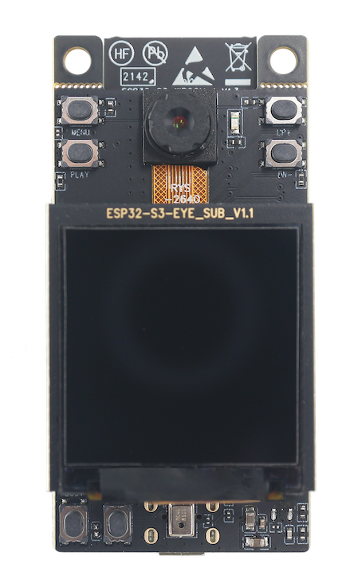

# ESP-WHO [[English]](./README.md)

ESP-WHO 是基于乐鑫芯片的图像处理开发平台，其中包含了实际应用中可能出现的开发示例。

## 概述

ESP-WHO 提供了人脸检测、人脸识别、行人检测、二维码识别等示例。您可以基于这些示例，衍生出丰富的实际应用。ESP-WHO 基于[ESP-DL](https://github.com/espressif/esp-dl)开发，配合各种外设可以实现许多有趣的应用。

## 新功能
1. 该仓库已完全重构。适配新版 [ESP-DL](https://github.com/espressif/esp-dl)
2. 支持新芯片 [ESP32-P4](https://www.espressif.com/en/products/socs/esp32-p4)。
3. 摄像头和深度学习模型现在异步执行，可实现更高的帧率。
4. 添加 [lvgl](https://lvgl.io/)(轻量级多功能图形库) 支持，您可以自由开发自己的图形应用程序。
5. 添加了新的行人检测模型。

某些芯片（如 esp32 和 esp32-s2）以及示例（如猫脸检测、颜色检测）目前不在此分支中，还未适配完成。旧分支可在此处找到。
[老 ESP-WHO 分支](https://github.com/espressif/esp-who/tree/release/v1.1.0)

## 支持的 ESP-IDF 版本

| ESP-IDF <br> [Release/v5.4](https://github.com/espressif/esp-idf/tree/release/v5.4) | ESP-IDF <br> [Release/v5.5](https://github.com/espressif/esp-idf/tree/release/v5.5) |
|-------------------------------------------------------------------------------------|-------------------------------------------------------------------------------------|
| :heavy_check_mark:                                                                  | :heavy_check_mark:                                                                  |

## 支持的开发版

| 开发板 | SoC | 支持的功能 | 外观 |
|:----------:|:---:|:-------------------|:-----:|
| [ESP32-P4 Function EV Board](https://docs.espressif.com/projects/esp-dev-kits/zh_CN/latest/esp32p4/esp32-p4-function-ev-board/user_guide.html) | esp32p4 | :musical_note: Audio <br/>:microphone: Audio Microphone  (es8311)<br/>:speaker: Audio Speaker  (es8311)<br/>:pager: LCD Display  (ek79007, ili9881c, lt8912b)<br/>:floppy_disk: uSD Card <br/>:point_up: Display Touch  (gt911)<br/> |  |
| [ESP32-S3-EYE](docs/zh_CN/get-started/ESP32-S3-EYE_Getting_Started_Guide.md) | esp32s3 | :musical_note: Audio <br/>:microphone: Audio Microphone <br/>:radio_button: Button <br/>:camera: Camera <br/>:pager: LCD Display  (st7789)<br/>:video_game: IMU <br/>:floppy_disk: uSD Card <br/> |  |
| [ESP32-S3-Korvo-2](https://docs.espressif.com/projects/esp-adf/zh_CN/latest/design-guide/dev-boards/user-guide-esp32-s3-korvo-2.html) | esp32s3 | :musical_note: Audio <br/>:microphone: Audio Microphone  (es7210)<br/>:speaker: Audio Speaker  (es8311)<br/>:radio_button: Button <br/>:camera: Camera <br/>:pager: LCD Display  (ili9341)<br/>:bulb: LED <br/>:floppy_disk: uSD Card <br/>:point_up: Display Touch  (tt21100)<br/> |  |


## 快速开始

ESP-WHO 的所有示例都存放在 [examples](./examples) 中，进入对应的文件夹，执行下面的步骤。

### 添加环境变量

linux下
```
export IDF_EXTRA_ACTIONS_PATH=/path_to_esp-who/tools/
```

### 设定目标平台，生成并配置 sdkconfig

#### (可选) 清理工作
```
rm sdkconfig                  # 清除 sdkconfig
rm dependencies.lock.*        # 清除 components 版本依赖
rm -rf managed_components     # 清除在线拉取的 components
rm -rf build                  # 清除编译目录
```

#### 设定目标 SOC 和默认 sdkconfig 配置文件。
```
idf.py reconfigure -DIDF_TARGET=target -DSDKCONFIG_DEFAULTS=sdkconfig.bsp.bsp_name
```
查看各个 example 下的 sdkconfig.bsp.* 文件，查看支持的 bsp_name。

#### (可选) 配置 sdkconfig 选项
```
idf.py menuconfig
```

### 烧录并监视

```
idf.py flash monitor [-p port]
```

## 参考资源

* 需要部署自己的模型可以参考 [ESP-DL](https://github.com/espressif/esp-dl), [ESP-DETECTION](https://github.com/espressif/esp-detection)。
* 开发板相关外设接口的使用可以参考 [ESP-BSP](https://github.com/espressif/esp-bsp)。
* camera 驱动相关可以参考 [ESP32_CAMERA](https://github.com/espressif/esp32-camera), [ESP_VIDEO_COMPONENTS](https://github.com/espressif/esp-video-components)。
* 如果你在使用中发现了错误或者需要新的功能，请先查看 [GitHub Issues](https://github.com/espressif/esp-who/issues)，确保该问题没有重复提交。
