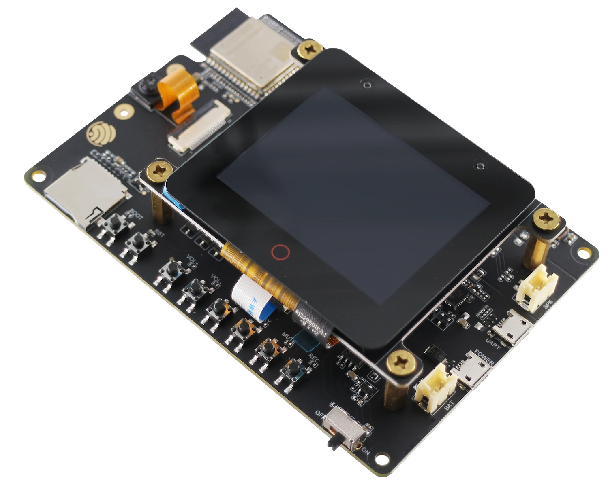

# BSP: ESP32-S3-Korvo-2

| [HW Reference](https://espressif-docs.readthedocs-hosted.com/projects/esp-adf/en/latest/design-guide/dev-boards/user-guide-esp32-s3-korvo-2.html) | [HOW TO USE API](API.md) | [EXAMPLES](#compatible-bsp-examples) |  |  |
| --- | --- | --- | --- | -- |

## Overview

<table>
<tr><td>

The ESP32-S3-Korvo-2 is a multimedia development board based on the ESP32-S3 chip. It is equipped with a two-microphone array which is suitable for voice recognition and near/far-field voice wake-up applications. The board integrates multiple peripherals such as LCD, camera, and microSD card. It also supports JPEG video stream processing. With all of its outstanding features, the board is an ideal choice for the development of low-cost and low-power network-connected audio and video products.

</td><td width="200">
  
</td></tr>
</table>

## Capabilities and dependencies

<!-- START_DEPENDENCIES -->

|     Available    |       Capability       |Controller/Codec|                                                   Component                                                  |   Version  |
|------------------|------------------------|----------------|--------------------------------------------------------------------------------------------------------------|------------|
|:heavy_check_mark:|     :pager: DISPLAY    |     ili9341    |  [espressif/esp_lcd_ili9341](https://components.espressif.com/components/espressif/esp_lcd_ili9341) idf  |^1 >=5.4|
|:heavy_check_mark:|:black_circle: LVGL_PORT|                |        [espressif/esp_lvgl_port](https://components.espressif.com/components/espressif/esp_lvgl_port)        |     ^2     |
|:heavy_check_mark:|    :point_up: TOUCH    |     tt21100    |[espressif/esp_lcd_touch_tt21100](https://components.espressif.com/components/espressif/esp_lcd_touch_tt21100)|     ^1     |
|:heavy_check_mark:| :radio_button: BUTTONS |                |               [espressif/button](https://components.espressif.com/components/espressif/button)               |     ^4     |
|:heavy_check_mark:|  :musical_note: AUDIO  |                |        [espressif/esp_codec_dev](https://components.espressif.com/components/espressif/esp_codec_dev)        |   ~1.3.1   |
|:heavy_check_mark:| :speaker: AUDIO_SPEAKER|     es8311     |                                                                                                              |            |
|:heavy_check_mark:| :microphone: AUDIO_MIC |     es7210     |                                                                                                              |            |
|:heavy_check_mark:|       :bulb: LED       |                |                                                      idf                                                     |    >=5.4   |
|:heavy_check_mark:|  :floppy_disk: SDCARD  |                |                                                      idf                                                     |    >=5.4   |
|        :x:       |    :video_game: IMU    |                |                                                                                                              |            |
|:heavy_check_mark:|     :camera: CAMERA    |                |         [espressif/esp32-camera](https://components.espressif.com/components/espressif/esp32-camera)         |   ^2.0.13  |

<!-- END_DEPENDENCIES -->

## Compatible BSP Examples

<!-- START_EXAMPLES -->

| Example | Description | Try with ESP Launchpad |
| ------- | ----------- | ---------------------- |
| [Audio Example](https://github.com/espressif/esp-bsp/tree/master/examples/audio) | Play and record WAV file | [Flash Example](https://espressif.github.io/esp-launchpad/?flashConfigURL=https://espressif.github.io/esp-bsp/config.toml&app=audio) |
| [Display Example](https://github.com/espressif/esp-bsp/tree/master/examples/display) | Show an image on the screen with a simple startup animation (LVGL) | [Flash Example](https://espressif.github.io/esp-launchpad/?flashConfigURL=https://espressif.github.io/esp-bsp/config.toml&app=display) |
| [Display, Audio and Photo Example](https://github.com/espressif/esp-bsp/tree/master/examples/display_audio_photo) | Complex demo: browse files from filesystem and play/display JPEG, WAV, or TXT files (LVGL) | [Flash Example](https://espressif.github.io/esp-launchpad/?flashConfigURL=https://espressif.github.io/esp-bsp/config.toml&app=display_audio_photo) |
| [Camera Example](https://github.com/espressif/esp-bsp/tree/master/examples/display_camera) | Stream camera output to display (LVGL) | [Flash Example](https://espressif.github.io/esp-launchpad/?flashConfigURL=https://espressif.github.io/esp-bsp/config.toml&app=display_camera) |
| [LVGL Benchmark Example](https://github.com/espressif/esp-bsp/tree/master/examples/display_lvgl_benchmark) | Run LVGL benchmark tests | - |
| [LVGL Demos Example](https://github.com/espressif/esp-bsp/tree/master/examples/display_lvgl_demos) | Run the LVGL demo player - all LVGL examples are included (LVGL) | [Flash Example](https://espressif.github.io/esp-launchpad/?flashConfigURL=https://espressif.github.io/esp-bsp/config.toml&app=display_lvgl_demo) |
| [Display Rotation Example](https://github.com/espressif/esp-bsp/tree/master/examples/display_rotation) | Rotate screen using buttons or an accelerometer (`BSP_CAPS_IMU`, if available) | [Flash Example](https://espressif.github.io/esp-launchpad/?flashConfigURL=https://espressif.github.io/esp-bsp/config.toml&app=display_rotation) |

<!-- END_EXAMPLES -->

<!-- START_BENCHMARK -->
<!-- END_BENCHMARK -->
