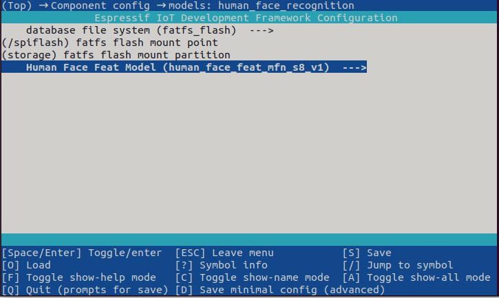
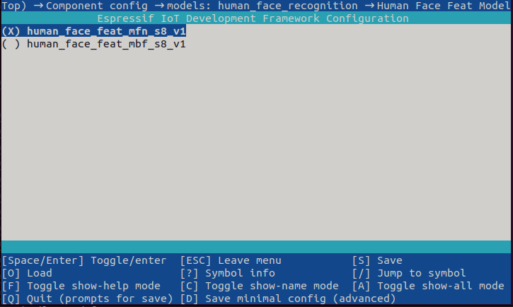

| Supported Targets | ESP32-S3 | ESP32-P4 |
| ----------------- | -------- | -------- |

# Human Face Recognition Example

## Run the Example

Run the example with default setting following steps:

```
idf.py set-target [Soc]
```

```
idf.py flash monitor
```

## Configure Human Face Feat Model

In addition to default setting, this example allows you to configure model version. Human face Recognition Model now support two different versions of models. You can choose one of them in menuconfig  HUMAN_FACE_FEAT_MODEL option. For model performance, please refer to [Models README](../../models/human_face_recognition/README.md) for more information. 

Steps to configure human face feat model is as follows:

Run `idf.py menuconfig` in the terminal and click (Top) -> Component config -> models: human_face_recognition to enter the model configuration interface, as shown below:



Click Human Face Feat Model to make the human face feat model configuration according to your needs, as shown in the following figure:



If you want to run your own model, which is not shown in the figure above, you can register your own model and configure the model correspondingly. 

Once you have finished the human face feat model configuration, Flash and Monitor the model.

```
idf.py flash monitor
```

Besides model version, Human face Recognition Model also support three different types of feature database. You can choose one of them in menuconfig DB_FILE_SYSTEM option.  

- fatfs_flash and spiffs save features to a 1MB flash partition.  
- fatfs_sdcard save features to sdcard.  
- Each feature cosumes 2050 bytes, including 2 bytes for id and 2048 bytes for feature data. 

# Example Output

If using ESP32-S3, after the flashing you should see the output at idf monitor by default:

```
I (1545) dl::Model: model:torch-jit-export, version:0

I (1545) dl::Model: Conv_0: Conv
I (1545) dl::Model: Conv_2: Conv
I (1545) dl::Model: Conv_4: Conv
I (1555) dl::Model: Conv_5: Conv
I (1555) dl::Model: Conv_7: Conv
I (1555) dl::Model: Conv_8: Conv
I (1565) dl::Model: Conv_10: Conv
I (1565) dl::Model: Conv_26: Conv
I (1575) dl::Model: Conv_28: Conv
I (1575) dl::Model: Conv_29: Conv
I (1575) dl::Model: Conv_32: Conv
I (1585) dl::Model: Conv_48: Conv
I (1585) dl::Model: Conv_31: Conv
I (1595) dl::Model: Conv_34: Conv
I (1595) dl::Model: Conv_50: Conv
I (1595) dl::Model: Conv_35: Conv
I (1605) dl::Model: Conv_38: Conv
I (1605) dl::Model: Conv_66: Conv
I (1605) dl::Model: Conv_37: Conv
I (1615) dl::Model: Conv_40: Conv
I (1615) dl::Model: Conv_68: Conv
I (1625) dl::Model: Conv_41: Conv
I (1625) dl::Model: Conv_69: Conv
I (1625) dl::Model: Conv_72: Conv
I (1635) dl::Model: Conv_43: Conv
I (1635) dl::Model: Conv_71: Conv
I (1645) dl::Model: Conv_74: Conv
I (1645) dl::Model: Concat_44: Concat
I (1655) dl::Model: Conv_75: Conv
I (1655) dl::Model: Conv_78: Conv
I (1655) dl::Model: Conv_45: Conv
I (1665) dl::Model: Conv_46: Conv
I (1665) dl::Model: Conv_47: Conv
I (1675) dl::Model: Conv_77: Conv
I (1675) dl::Model: Conv_80: Conv
I (1675) dl::Model: Conv_81: Conv
I (1685) dl::Model: Conv_83: Conv
I (1685) dl::Model: Concat_84: Concat
I (1695) dl::Model: Conv_85: Conv
I (1695) dl::Model: Conv_86: Conv
I (1695) dl::Model: Conv_87: Conv
I (1715) MemoryManagerGreedy: Maximum mermory size: 202400

I (1725) dl::Model: model:torch-jit-export, version:0

I (1725) dl::Model: Conv_0: Conv
I (1725) dl::Model: PRelu_1: PRelu
I (1725) dl::Model: Conv_2: Conv
I (1725) dl::Model: PRelu_3: PRelu
I (1735) dl::Model: Conv_4: Conv
I (1735) dl::Model: PRelu_5: PRelu
I (1735) dl::Model: Conv_6: Conv
I (1745) dl::Model: Conv_7: Conv
I (1745) dl::Model: PRelu_8: PRelu
I (1755) dl::Model: Conv_9: Conv
I (1755) dl::Model: Conv_10: Conv
I (1755) dl::Model: PRelu_11: PRelu
I (1765) dl::Model: Conv_12: Conv
I (1765) dl::Model: PRelu_13: PRelu
I (1775) dl::Model: Conv_14: Conv
I (1775) dl::Model: Conv_15: Conv
I (1785) dl::Model: PRelu_16: PRelu
I (1785) dl::Model: Conv_17: Conv
I (1785) dl::Model: PRelu_18: PRelu
I (1795) dl::Model: Conv_19: Conv
I (1795) dl::Model: Conv_20: Conv
I (1805) dl::Model: Conv_21: Conv
I (1805) dl::Model: Conv_22: Conv
I (1815) MemoryManagerGreedy: Maximum mermory size: 49232

I (1825) dl::Model: model:torch-jit-export, version:0

I (1825) dl::Model: Conv_0: Conv
I (1825) dl::Model: PRelu_1: PRelu
I (1825) dl::Model: Conv_2: Conv
I (1835) dl::Model: PRelu_3: PRelu
I (1835) dl::Model: Conv_4: Conv
I (1845) dl::Model: PRelu_5: PRelu
I (1845) dl::Model: Conv_6: Conv
I (1845) dl::Model: PRelu_7: PRelu
I (1855) dl::Model: Conv_8: Conv
I (1855) dl::Model: Conv_9: Conv
I (1865) dl::Model: PRelu_10: PRelu
I (1865) dl::Model: Conv_11: Conv
I (1865) dl::Model: PRelu_12: PRelu
I (1875) dl::Model: Conv_13: Conv
I (1875) dl::Model: Add_14: Add
I (1875) dl::Model: Conv_15: Conv
I (1885) dl::Model: PRelu_16: PRelu
I (1885) dl::Model: Conv_17: Conv
I (1895) dl::Model: PRelu_18: PRelu
I (1895) dl::Model: Conv_19: Conv
I (1905) dl::Model: Add_20: Add
I (1905) dl::Model: Conv_21: Conv
I (1905) dl::Model: PRelu_22: PRelu
I (1915) dl::Model: Conv_23: Conv
I (1915) dl::Model: PRelu_24: PRelu
I (1925) dl::Model: Conv_25: Conv
I (1925) dl::Model: Add_26: Add
I (1925) dl::Model: Conv_27: Conv
I (1935) dl::Model: PRelu_28: PRelu
I (1935) dl::Model: Conv_29: Conv
I (1945) dl::Model: PRelu_30: PRelu
I (1945) dl::Model: Conv_31: Conv
I (1945) dl::Model: Add_32: Add
I (1955) dl::Model: Conv_33: Conv
I (1955) dl::Model: PRelu_34: PRelu
I (1965) dl::Model: Conv_35: Conv
I (1965) dl::Model: PRelu_36: PRelu
I (1965) dl::Model: Conv_37: Conv
I (1975) dl::Model: Conv_38: Conv
I (1975) dl::Model: PRelu_39: PRelu
I (1985) dl::Model: Conv_40: Conv
I (1985) dl::Model: PRelu_41: PRelu
I (1985) dl::Model: Conv_42: Conv
I (1995) dl::Model: Add_43: Add
I (1995) dl::Model: Conv_44: Conv
I (2005) dl::Model: PRelu_45: PRelu
I (2005) dl::Model: Conv_46: Conv
I (2005) dl::Model: PRelu_47: PRelu
I (2015) dl::Model: Conv_48: Conv
I (2015) dl::Model: Add_49: Add
I (2025) dl::Model: Conv_50: Conv
I (2025) dl::Model: PRelu_51: PRelu
I (2025) dl::Model: Conv_52: Conv
I (2035) dl::Model: PRelu_53: PRelu
I (2035) dl::Model: Conv_54: Conv
I (2045) dl::Model: Add_55: Add
I (2045) dl::Model: Conv_56: Conv
I (2055) dl::Model: PRelu_57: PRelu
I (2055) dl::Model: Conv_58: Conv
I (2055) dl::Model: PRelu_59: PRelu
I (2065) dl::Model: Conv_60: Conv
I (2065) dl::Model: Add_61: Add
I (2065) dl::Model: Conv_62: Conv
I (2075) dl::Model: PRelu_63: PRelu
I (2075) dl::Model: Conv_64: Conv
I (2085) dl::Model: PRelu_65: PRelu
I (2085) dl::Model: Conv_66: Conv
I (2095) dl::Model: Add_67: Add
I (2095) dl::Model: Conv_68: Conv
I (2095) dl::Model: PRelu_69: PRelu
I (2105) dl::Model: Conv_70: Conv
I (2105) dl::Model: PRelu_71: PRelu
I (2105) dl::Model: Conv_72: Conv
I (2115) dl::Model: Add_73: Add
I (2115) dl::Model: Conv_74: Conv
I (2125) dl::Model: Conv_76: Conv
I (2125) dl::Model: PRelu_75: PRelu
I (2125) dl::Model: PRelu_77: PRelu
I (2135) dl::Model: Concat_78: Concat
I (2135) dl::Model: Conv_79: Conv
I (2145) dl::Model: PRelu_80: PRelu
I (2145) dl::Model: Conv_81: Conv
I (2155) dl::Model: Conv_82: Conv
I (2155) dl::Model: Concat_83: Concat
I (2155) dl::Model: Conv_84: Conv
I (2165) dl::Model: PRelu_85: PRelu
I (2165) dl::Model: Conv_86: Conv
I (2175) dl::Model: PRelu_87: PRelu
I (2175) dl::Model: Conv_88: Conv
I (2185) dl::Model: Add_89: Add
I (2185) dl::Model: Conv_90: Conv
I (2185) dl::Model: PRelu_91: PRelu
I (2195) dl::Model: Conv_92: Conv
I (2195) dl::Model: PRelu_93: PRelu
I (2195) dl::Model: Conv_94: Conv
I (2205) dl::Model: Add_95: Add
I (2205) dl::Model: Conv_96: Conv
I (2215) dl::Model: Conv_98: Conv
I (2215) dl::Model: PRelu_97: PRelu
I (2215) dl::Model: PRelu_99: PRelu
I (2225) dl::Model: Concat_100: Concat
I (2225) dl::Model: Conv_101: Conv
I (2235) dl::Model: Conv_102: Conv
I (2275) MemoryManagerGreedy: Maximum mermory size: 840448

id: 3, sim: 0.762376
```