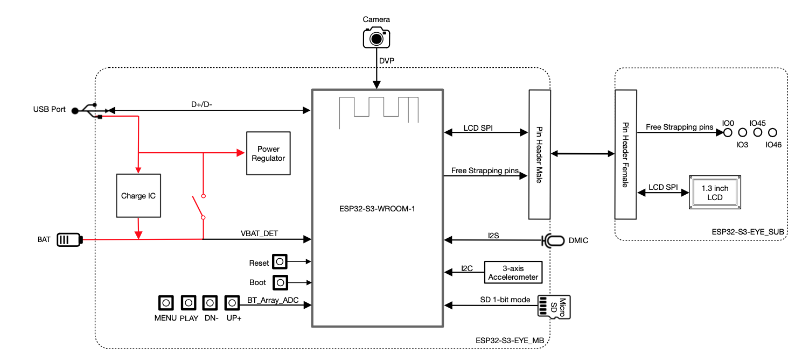
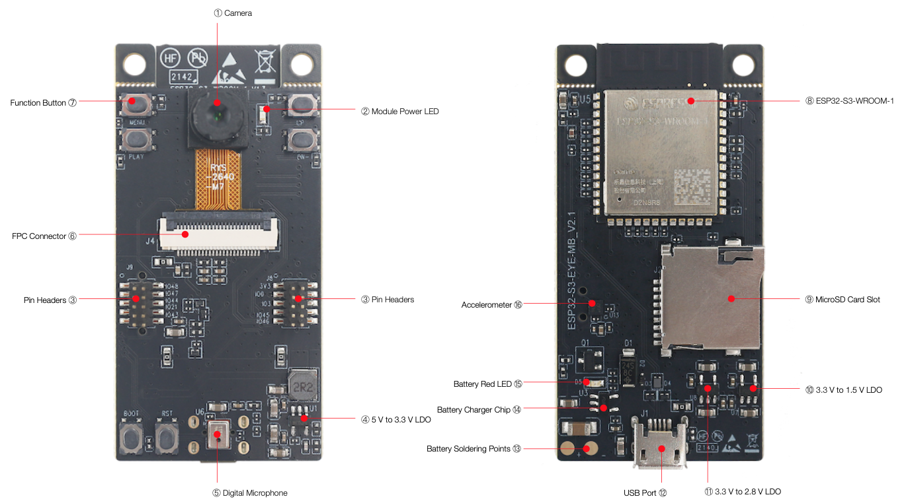
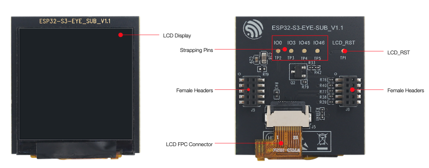
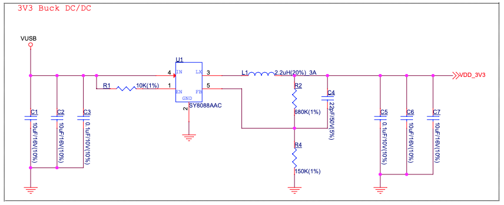
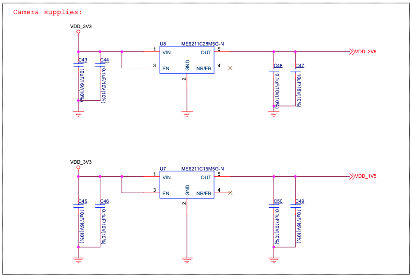
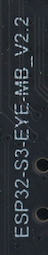
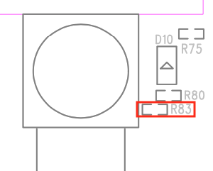
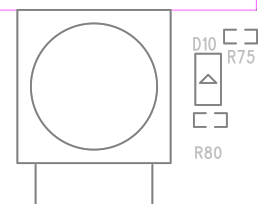

# ESP32-S3-EYE v2.2 <!-- omit in toc -->

[[中文]](../../zh_CN/get-started/ESP32-S3-EYE_Getting_Started_Guide.md)

- [1. Getting Started](#1-getting-started)
  - [1.1. Overview](#11-overview)
  - [1.2. Comparison with ESP-EYE](#12-comparison-with-esp-eye)
  - [1.3. Block Diagram](#13-block-diagram)
  - [1.4. Components on the ESP32-S3-EYE-MB Main Board](#14-components-on-the-esp32-s3-eye-mb-main-board)
  - [1.5. Components on the ESP32-S3-EYE-SUB Sub Board](#15-components-on-the-esp32-s3-eye-sub-sub-board)
  - [1.6. Contents and Packaging](#16-contents-and-packaging)
    - [1.6.1. Retail Orders](#161-retail-orders)
    - [1.6.2. Wholesale Orders](#162-wholesale-orders)
  - [1.7. Default Firmware and Function Test](#17-default-firmware-and-function-test)
- [2. Start Application Development](#2-start-application-development)
  - [2.1. Required Hardware](#21-required-hardware)
  - [2.2. Optional Hardware](#22-optional-hardware)
  - [2.3. Hardware Setup](#23-hardware-setup)
  - [2.4. Software Setup](#24-software-setup)
- [3. Hardware Reference](#3-hardware-reference)
  - [3.1. Notes on GPIO Allocations](#31-notes-on-gpio-allocations)
  - [3.2. Independent Module and Camera Power Supply](#32-independent-module-and-camera-power-supply)
- [4. Hardware Revision Details](#4-hardware-revision-details)
  - [4.1. Revision History](#41-revision-history)
  - [4.2. known Issues](#42-known-issues)
- [5. Related Documents](#5-related-documents)
  - [5.1. Datasheet](#51-datasheet)
  - [5.2. Schematic](#52-schematic)
  - [5.3. PCB Layout](#53-pcb-layout)
  - [5.4. Dimensions](#54-dimensions)
  - [5.5. 3D Printed Case](#55-3d-printed-case)

This user guide will help you get started with ESP32-S3-EYE v2.2 and will also provide more in-depth information.

> **Notice**
>
> If you use ESP32-S3-EYE v2.1, please follow this guide. The differences between v2.2 and v2.1 are described in Section [Hardware Revision Details](#4-hardware-revision-details).

The ESP32-S3-EYE is a small-sized AI development board produced by [Espressif](https://espressif.com). It is based on the [ESP32-S3](https://www.espressif.com/en/products/socs/esp32-s3) SoC and [ESP-WHO](https://github.com/espressif/esp-who), Espressif’s AI development framework. It features a 2-Megapixel camera, an LCD display, and a microphone, which are used for image recognition and audio processing. ESP32-S3-EYE offers plenty of storage, with an 8 MB Octal PSRAM and a 8 MB flash. It also supports image transmission via Wi-Fi and debugging through a Micro-USB port. With ESP-WHO, you can develop a variety of AIoT applications, such as smart doorbell, surveillance systems, facial recognition time clock, etc.

|  | 
|:--:| 
|ESP32-S3-EYE|

The document consists of the following major sections:

-   [Getting started](#1-getting-started): Introduction of the board, block diagram, description of key components, contents and packaging, as well as quick guide to use the board.
-   [Start Application Development](#2-start-application-development): Hardware and software setup instructions to flash firmware onto the board.
-   [Hardware Reference](#3-hardware-reference): More detailed information about the board's hardware.
-   [Hardware Revision Details](#4-hardware-revision-details): Hardware revision history, known issues, and links to user guides for previous versions (if any) of the board.
-   [Related Documents](#5-related-documents): Links to related documentation.

# 1. Getting Started

## 1.1. Overview

The ESP32-S3-EYE board consists of two parts: the main board (ESP32-S3-EYE-MB) that integrates the ESP32-S3-WROOM-1 module, camera, SD card slot, digital microphone, USB port, and function buttons; and the sub board (ESP32-S3-EYE-SUB) that contains an LCD display. The main board and sub board are connected through pin headers.

## 1.2. Comparison with ESP-EYE

The ESP32-S3-EYE has some additional functions comparing to [ESP-EYE](https://github.com/espressif/esp-who/blob/master/docs/en/get-started/ESP-EYE_Getting_Started_Guide.md), an ESP32-based development board. The comparison below covers key differences between the two boards:

| Feature | ESP32-S3-EYE | ESP-EYE | 
|---------|--------------|-----------|
| Chip embedded             | ESP32-S3         | ESP32              |
| PSRAM                    | 8 MB Octal PSRAM | 8 MB Quad PSRAM    |
| Flash                   | 8 MB flash       | 4 MB flash         |
| LCD display               | Yes              | None               |
| Accelerometer             | Yes              | None               |
| Alternative power supply  | External battery (optional) | None               |
| USB-to-UART bridge        | No need. Functionality is provided by ESP32-S3 USB Serial/JTAG interface. | Yes |
| Antenna connector        | No need. Antenna is provided by the ESP32-S3-WROOM-1 module. | Yes |

## 1.3. Block Diagram

The block diagram below presents main components of the ESP32-S3-EYE-MB main board (on the left) and the ESP32-S3-EYE-SUB sub board (on the right), as well as the interconnections between components.

|  | 
|:--:| 
|ESP32-S3-EYE Block Diagram|

The following sections will describe the key components on the main board and the sub board, respectively.

## 1.4. Components on the ESP32-S3-EYE-MB Main Board

|  | 
|:--:| 
|ESP32-S3-EYE-MB - front and back|

The key components of the board are described from front view to back view, starting from the camera, in an anti-clockwise direction.

| No. | Key Component            |       Description |
|-----|----|--|
| 1   | Camera                   | The camera [OV2640](https://github.com/espressif/esp32-camera) with 2 million pixels has a 66.5° field of view and a maximum resolution of 1600x1200. You can change the resolution when developing applications.|
| 2   | Module Power LED            | The LED (green) turns on when USB power is connected to the board. If it is not turned on, it indicates either the USB power is not supplied, or the 5 V to 3.3 V LDO is broken. Software can configure GPIO3 to set different LED statuses (turned on/off, flashing) for different statuses of the board. Note that GPIO3 must be set up in open-drain mode. Pulling GPIO3 up may burn the LED.  |
| 3   | Pin Headers              | Connect the female headers on the sub board.|
| 4   | 5 V to 3.3 V LDO         | Power regulator that converts a 5 V supply into a 3.3 V output for the module.|
| 5   | Digital Microphone       | The digital I2S MEMS microphone features 61 dB SNR and –26 dBFS sensitivity, working at 3.3 V.|
| 6   | FPC Connector            | Connects the main board and the sub board. |
| 7   | Function Button          | There are six function buttons on the board. Users can configure any functions as needed except for the RST button. |
| 8   | ESP32-S3-WROOM-1         | The ESP32-S3-WROOM-1 module embeds the ESP32-S3R8 chip variant that provides Wi-Fi and Bluetooth 5 (LE) connectivity, as well as dedicated vector instructions for accelerating neural network computing and signal processing. On top of the integrated 8 MB Octal SPI PSRAM offered by the SoC, the module also comes with 8 MB flash, allowing for fast data access. ESP32-S3-WROOM-1U module is also supported.|
| 9   | MicroSD Card Slot        | Used for inserting a MicroSD card to expand memory capacity. |
| 10  | 3.3 V to 1.5 V LDO       | Power regulator that converts a 3.3 V supply into a 1.5 V output for the camera.|
| 11  | 3.3 V to 2.8 V LDO       | Power regulator that converts a 3.3 V supply into a 2.8 V output for the camera.|
| 12  | USB Port           | A Micro-USB port used for 5 V power supply to the board, as well as for communication with the chip via GPIO19 and GPIO20.|
  13  | Battery Soldering Points | Used for soldering a battery socket to connect an external Li-ion battery that can serve as an alternative power supply to the board. If you use an external battery, make sure it has built-in protection circuit and fuse. The recommended specifications of the battery: capacity > 1000 mAh, output voltage 3.7 V, input voltage 4.2 V – 5 V.|
| 14  | Battery Charger Chip     | 1 A linear Li-ion battery charger (ME4054BM5G-N) in ThinSOT package. The power source for charging is the **USB Port**.|
| 15  | Battery Red LED          | When the USB power is connected to the board and a battery is not connected, the red LED blinks. If a battery is connected and being charged, the red LED turns on. When the battery is fully charged, it turns off.  |
| 16  | Accelerometer            | Three-axis accelerometer (QMA7981) for screen rotation, etc. |

## 1.5. Components on the ESP32-S3-EYE-SUB Sub Board

|  | 
|:--:| 
|ESP32-S3-EYE-SUB - front and back|

The key components of the board are described from front view to back view, starting from the LCD display, in an anti-clockwise direction.

| Key Component      | Description |
|--------------------|----|
| LCD Display        | 1.3” LCD display, connected to ESP32-S3 over the SPI bus. |
| Strapping Pins     | Four strapping pins led out from the main board. They can be used as testing points. |
| Female Headers     | Used for mounting onto the pin headers on the main board. |
| LCD FPC Connector  | Connects the sub board and the LCD display.             |
| LCD_RST            | LCD_RST testing point. You can use it to reset the LCD display with control signals.|

## 1.6. Contents and Packaging

### 1.6.1. Retail Orders

If you order a few samples, each board comes in an individual box. Each box contains:

-   1 x ESP32-S3-EYE-MB main board
-   1 x ESP32-S3-EYE-SUB sub board

The main board and sub board are assembled by default.

For retail orders, please go to <https://www.espressif.com/en/company/contact/buy-a-sample>.

### 1.6.2. Wholesale Orders

If you order in bulk, the boards come in large cardboard boxes.

For wholesale orders, please go to <https://www.espressif.com/en/contact-us/sales-questions>.

## 1.7. Default Firmware and Function Test

Each ESP32-S3-EYE board comes with pre-built [default firmware](https://github.com/espressif/esp-who/tree/master/default_bin/esp32-s3-eye) that allows you to test its functions including voice wake-up, voice command recognition, face detection and recognition.

To test the board's functions, you need the following hardware:

-   1 x ESP32-S3-EYE
-   1 x USB 2.0 cable (Standard-A to Micro-B), for USB power supply

Before powering up your board, please make sure that it is in good condition with no obvious signs of damage. Both the main board and the sub board should be firmly connected together. Then, follow the instructions described below:

1. Connect the board to a power supply through the **USB Port** using a USB cable. While the board is powered up, you will notice the following responses:

* The **Module Power LED** turns on for a few seconds, indicating that the default firmware is being loaded. 
* The **Module Power LED** turns off, indicating the default firmware has been loaded. The board enters human face recognition mode by default. 
* The LCD display shows live video streaming.

At this point, the board is ready for further instructions. You can control the board with either function buttons or voice commands. Function button control is described first:

2. Face the camera so whole human face is visible on the screen for the board to detect. Once a human face is detected, the board displays a blue rectangle.
3. Press **MENU** so that the board enters an ID (starting from 1) for a detected human face.
4. Press **UP+** so that the board starts face recognition. Once a face is recognized, the board displays the entered face ID. If it doesn’t know the face, it displays “WHO?”.
5. Press **PLAY** to delete the latest face ID. The board displays "XXX ID(S) LEFT".

To control the board with voice commands, follow the instructions below:

1. Complete step 1 described previously and notice responses from the board.
2. Activate the board with the default English wake word “Hi ESP”. When the wake word is detected, the **Module Power LED** will turn on, indicating that the board is ready for a speech command.
3. Say an English speech command to control the board. Once a speech command is recognized, the **Module Power LED** will blink. The supported English speech commands in face recognition mode are listed below:

| Default English Speech Commands | Response |
|---------------------------------|----------|
| Enter face       | The board enters a human face ID. |
| Recognize face   | The board displays a recognized human face ID, or "WHO?" for an unrecognized face. |  
| Delete face      | The board deletes the latest human face ID entered and displays "XXX ID(S) LEFT". |

4. After waking up the board as described in step 2, you can also switch the board's working mode with speech commands. Once a speech command is recognized, the **Module Power LED** will blink.

| Speech Commands for Different Working Modes | Response |
|---------------------------------|----------|
| Face recognition    | The board displays a blue rectangle if a human face is detected. |  
| Motion detection    | The board displays a solid blue rectangle in upper-left corner if motion is detected. |
| Display only        | The board displays only live video streaming. |
| Stop working        | The board does nothing and displays Espressif logo. |

Now you get the first experience with the board. The following sections provide further information about how to flash firmware onto the board, configuration options, related resources, and more.

# 2. Start Application Development

This section provides instructions on how to do hardware/software setup and flash firmware onto the board for application development.

## 2.1. Required Hardware

-   1 x ESP32-S3-EYE
-   1 x USB 2.0 cable (Standard-A to Micro-B), for USB power supply and flashing firmware on to the board
-   1 x Computer running Windows, Linux, or macOS

## 2.2. Optional Hardware

-   1 x MicroSD card
-   1 x Li-ion battery
-   1 x [3D Printed case](#55-3d-printed-case)

> **Notice**
>
> Be sure to use a Li-ion battery that has built-in protection circuit.

## 2.3. Hardware Setup

Prepare the board for loading of the first sample application:
 
Connect the board with the computer through the **USB Port** using a USB cable. The **Module Power LED** should turn on. Assuming that a battery is not connected, the **Battery Red LED** will blink.

Now the board is ready for software setup.

## 2.4. Software Setup

After hardware setup, you can proceed with preparation of development tools. Go to the [guide to ESP-WHO](https://github.com/espressif/esp-who), which will walk you through the following steps:

1. [Get ESP-IDF](https://github.com/espressif/esp-who/#get-esp-idf) which provides a common framework to develop applications for ESP32-S3 in C language.
2. [Get ESP-WHO](https://github.com/espressif/esp-who/#get-esp-who) which is an image processing platform that runs on ESP-IDF.
3. [Run Examples](https://github.com/espressif/esp-who/#run-examples) that are provided by ESP-WHO.

# 3. Hardware Reference

This section provides more detailed information about the board's hardware.

## 3.1. Notes on GPIO Allocations

Except for GPIO3 that can be used to configure LED statuses, all GPIOs of the **ESP32-S3-WROOM-1** module have already been used to control specific components or functions of the board. If you would like to configure any pins yourself, please refer to the schematics provided in Section [Related Documents](#5-related-documents).

## 3.2. Independent Module and Camera Power Supply

The ESP32-S3-EYE board features independent power supplies to the camera and the remaining components. This should reduce noise in the audio signal from module components and improve overall performance of the components.

|| 
|:--:| 
|ESP32-S3-EYE - Module Power Supply|

|| 
|:--:| 
|ESP32-S3-EYE - Camera Power Supplies|

# 4. Hardware Revision Details

## 4.1. Revision History

Compared to ESP32-S3-EYE v2.1, ESP32-S3-EYE v2.2 has two changes in hardware: 1) marking on the main board，2) additional current limiting resistor on the main board; and one change in firmware: additional support for English wake-up word and commands.

Changes in hardware are described in detail below:

1.  Marking on the (back of) main board: ESP32-S3-EYE v2.2 has marking "ESP32-S3-EYE-MB_V2.2" on the main board, while ESP32-S3-EYE v2.1 has marking "ESP32-S3-EYE-MB_V2.1" on the main board.

| ESP32-S3-EYE-MB_V2.2 Marking      | ESP32-S3-EYE-MB_V2.1 Marking |
|--------------------|----|
|   | |

2.  The current limiting resistor R83 is added to the ESP32-S3-EYE v2.2 main board to protect the **Module Power LED** from burning in case GPIO3 is pulled up.

| ESP32-S3-EYE v2.2 with R83     | ESP32-S3-EYE v2.1 Without R83  |
|--------------------|----|
|   | |

3.  The **main board schematics**, **main board PCB layout diagrams**, **main board dimension diagrams**, **main board dimension source files** are updated because of the two hardware changes. (See [Related Documents](#5-related-documents)).

## 4.2. known Issues

ESP32-S3-EYE does not have a USB-to-UART bridge, which may cause a problem: If the program flashed onto the board keeps the chip rebooting, you cannot flash more programs onto the board.

In case this issue occurs, you need to:

- Hold down BOOT button and press RST button, then release RST button first, and BOOT button next. In this way, the board enters Firmware Download mode and you can start flashing program onto the board.
- After flashing the program, press RST button to start the program.

# 5. Related Documents

## 5.1. Datasheet

-   [ESP32-S3 Datasheet](https://www.espressif.com/sites/default/files/documentation/esp32-s3_datasheet_en.pdf) (PDF)
-   [ESP32-S3-WROOM-1 & ESP32-S3-WROOM-1U Datasheet](https://www.espressif.com/sites/default/files/documentation/esp32-s3-wroom-1_wroom-1u_datasheet_en.pdf) (PDF)

## 5.2. Schematic

-   [ESP32-S3-EYE-MB v2.2 Main Board Schematic](https://dl.espressif.com/dl/schematics/SCH_ESP32-S3-EYE-MB_20211201_V2.2.pdf) (PDF)
-   [ESP32-S3-EYE-MB v2.1 Main Board Schematic](https://dl.espressif.com/dl/schematics/SCH_ESP32-S3-EYE-MB_20210913_V2.1.pdf) (PDF)
-   [ESP32-S3-EYE-SUB Sub Board Schematic](https://dl.espressif.com/dl/schematics/SCH_ESP32-S3-EYE_SUB_V1.1_20210913.pdf) (PDF)

## 5.3. PCB Layout

-   [ESP32-S3-EYE-MB v2.2 Main Board PCB Layout](https://dl.espressif.com/dl/schematics/PCB_ESP32-S3-EYE_MB_V2.2_20211201.pdf) (PDF)
-   [ESP32-S3-EYE-MB v2.1 Main Board PCB Layout](https://dl.espressif.com/dl/schematics/PCB_ESP32-S3-EYE_MB_V2.1_20210913.pdf) (PDF)
-   [ESP32-S3-EYE-SUB Sub Board PCB Layout](https://dl.espressif.com/dl/schematics/PCB_ESP32-S3-EYE_SUB_V1.1_20210913.pdf) (PDF)

## 5.4. Dimensions

-   [ESP32-S3-EYE-MB v2.2 Main Board Front Dimensions](https://dl.espressif.com/dl/schematics/DXF_ESP32-S3-EYE_MB_top_V2.2_20211207.pdf) (PDF)
-   [ESP32-S3-EYE-MB v2.1 Main Board Front Dimensions](https://dl.espressif.com/dl/schematics/DXF_ESP32-S3-EYE_MB_top_V2.1_20211111.pdf) (PDF)
-   [ESP32-S3-EYE-MB v2.2 Main Board Back Dimensions](https://dl.espressif.com/dl/schematics/DXF_ESP32-S3-EYE_MB_Bottom_V2.2_20211207.pdf) (PDF)
-   [ESP32-S3-EYE-MB v2.1 Main Board Back Dimensions](https://dl.espressif.com/dl/schematics/DXF_ESP32-S3-EYE_MB_Bottom_V2.1_20211111.pdf) (PDF)
-   [ESP32-S3-EYE-SUB Sub Board Dimensions](https://dl.espressif.com/dl/schematics/DXF_ESP32-S3-EYE_SUB_V1.1_20211111.pdf) (PDF)
-   [ESP32-S3-EYE-MB v2.2 Main Board Front Dimensions Source File](https://dl.espressif.com/dl/schematics/DXF_ESP32-S3-EYE_MB_top_V2.2_20211207.dxf) (DXF) - You can view it with [Autodesk Viewer](https://viewer.autodesk.com/) online
-   [ESP32-S3-EYE-MB v2.1 Main Board Front Dimensions Source File](https://dl.espressif.com/dl/schematics/DXF_ESP32-S3-EYE_MB_top_V2.1_20211111.dxf) (DXF) - You can view it with [Autodesk Viewer](https://viewer.autodesk.com/) online
-   [ESP32-S3-EYE-MB v2.2 Main Board Back Dimensions Source File](https://dl.espressif.com/dl/schematics/DXF_ESP32-S3-EYE_MB_Bottom_V2.2_20211207.dxf) (DXF) - You can view it with [Autodesk Viewer](https://viewer.autodesk.com/) online
-   [ESP32-S3-EYE-MB v2.1 Main Board Back Dimensions Source File](https://dl.espressif.com/dl/schematics/DXF_ESP32-S3-EYE_MB_Bottom_V2.1_20211111.dxf) (DXF) - You can view it with [Autodesk Viewer](https://viewer.autodesk.com/) online
-   [ESP32-S3-EYE-SUB Sub Board Dimensions Source File](https://dl.espressif.com/dl/schematics/DXF_ESP32-S3-EYE_SUB_V1.1_20211111.dxf) (DXF) - You can view it with [Autodesk Viewer](https://viewer.autodesk.com/) online

## 5.5. 3D Printed Case

The following 3D model is a two-part case you can 3D print for your ESP32-S3-EYE. Do note that with all 3D Printed products, there will be a variance in tolerance and fitting. Your success may vary.

- [ESP32-S3-EYE Top Case](../../_static/get-started/ESP32-S3-EYE_3dpcase_top.STL)
- [ESP32-S3-EYE Bottom Case](../../_static/get-started/ESP32-S3-EYE_3dpcase_btm.STL)

|| 
|:--:| 
|ESP32-S3-EYE - Case 3D printed on [BambuLab P1S](https://bambulab.com/en/p1)|

For further design documentation for the board, please contact us at [<sales@espressif.com>](sales@espressif.com).
