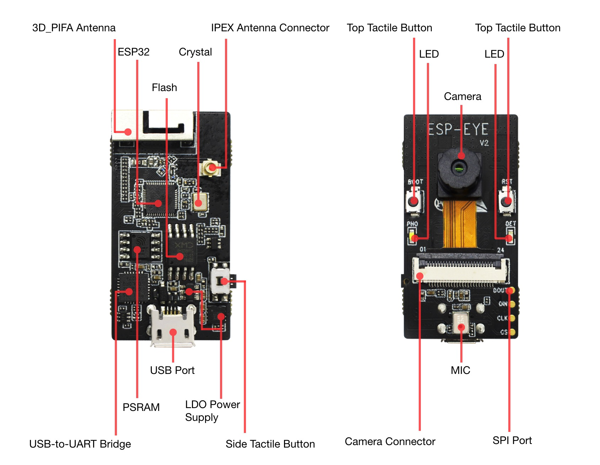
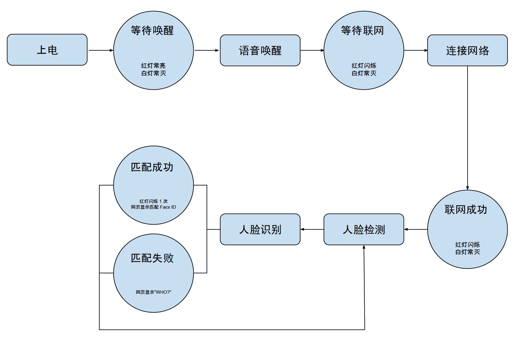
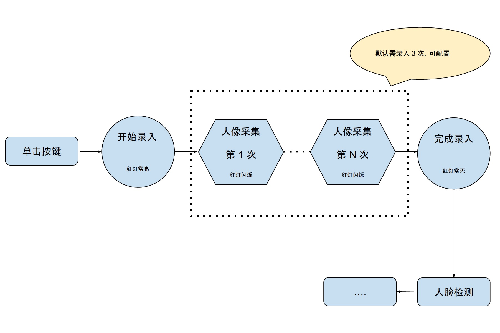

# ESP-EYE 入门指南

[[EN]](../../en/get-started/ESP-EYE_V2.0_Getting_Started_Guide.md)

## 准备工作

* 1 × ESP-EYE V2.0 开发板
* 1 × Micro USB B 电缆
* 1 × PC（Windows、Linux 或 Mac OS）

## 简介

ESP-EYE 是一款面向人脸识别和语音识别市场的开发板，搭载 ESP32 芯片、200 W 像素摄像头、数字麦克风、8 MB PSRAM 和 4 MB Flash，可满足各种 AI 应用开发需求。此外，该开发板还支持 Wi-Fi 图像传输、Micro USB 调试和供电，可以实现语音唤醒、人脸检测与识别等功能，可协助用户开发高度集成的 AI 解决方案。

## 硬件组成

ESP-EYE 开发板的产品图请见下方：



具体包括以下硬件组成：

* **3D_PIFA Antenna（3D_PIFA 天线）**

	3D PIFA 天线。用户可通过选贴 R14/R15 电阻，选用 3D 天线（选贴 R15）或外接 IPEX 天线（选贴 R14）。

* **IPEX Connector（IPEX 连接器）**

	用于外接 IPEX 天线。用户可通过选贴 R14/R15 电阻，选用 3D 天线（选贴 R15）或外接 IPEX 天线（选贴 R14）。

* **ESP32 Chip（ESP32 芯片）**

	集成 2.4 GHz Wi-Fi 和蓝牙双模的单芯片。

* **Crystal（晶振）**

	ESP32 的外部晶振时钟源。

* **Flash & PSRAM**

	存储芯片，用于储存程序。

* **CP2102 USB-UART Chip（USB 转 UART 芯片）**

	实现 USB 到 UART 的转换功能。

* **USB Port（USB 供电接口）**

	为整个系统供电。

* **LDO Power Supply（LDO 供电芯片）**

	为 ESP32 芯片、摄像头、LED 指示灯等部件提供各自所需的电压。

* **Side Tactile Button（侧面轻触按键）**

	功能按键。

* **Top Tactile Button（正面轻触按键）**

	用于 ESP32 的 RST（复位）、BOOT（下载），不建议设置他用。

* **LED 指示灯**

	红灯和白灯各一个，可用于指示唤醒、联网、人脸检测、人脸录入、人脸识别等不同过程中的状态。

* **Camera（摄像头）**

	实现检测识别等功能。

* **Camera Connector（摄像头连接器）**

	用于外接摄像头模块。

* **MIC（麦克风）**

	数字型麦克风，实现语音控制功能。

* **SPI Port（SPI 接口）**

	预留数据传输接口。


## 软件开发

ESP-EYE 可在 Linux、MacOs、Windows 操作系统中完成软件烧写。目前，必须进行开发环境的工具链配置，详见下方介绍。

### 准备工作

- 阅读 [ESP-IDF编程指南](https://docs.espressif.com/projects/esp-idf/zh_CN/v3.1.1/get-started/index.html)，参考相应章节，配置工具链；
- 准备 Micro USB 线，用于连接 PC 和 ESP-EYE 开发板；
- 选择一款适合开发环境的工具，例如 Terminal (Linux/MacOS) 或 MinGW (Windows) 等。

### 软件获取

打开终端（例如 Linux 环境下的 Terminal），将软件代码克隆到本地：

```
git clone --recursive https://github.com/espressif/esp-who.git 
```

执行以上命令会默认生成一个 `esp-who` 的文件夹。

> 注意不要忘记 `--recursive` 选项。如果你克隆 ESP-IDF 时没有带这个选项，你还需要运进入相应文件夹中，执行以下命令下载相应的子模块：
```
git submodule update --init --recursive
```

### 设置路径

请参考[设置路径](https://docs.espressif.com/projects/esp-idf/zh_CN/v3.1.1/get-started/index.html#get-started-setup-path)章节，将 `IDF_PATH` 设置为 `esp-who/esp-idf`。

### 软件烧写

下面，我们以 Linux 环境为例，介绍向 ESP-EYE 烧写程序的过程：

- 首先将 ESP-EYE 接入 PC，接入即上电；
- 通过命令 `ls /dev/ttyUSB*` 查看开发板是否成功接入 PC。成功接入后，列表将新增类似 `/dev/ttyUSB0` 的信息；
- 进入一个 example 工程文件中，例如 `cd esp-who/examples/single_chip/recognition_solution`；
- 执行 `make defconfig` 进行默认配置；
- 执行 `make menuconfig`，在 `Serial flasher config` 中设置 `Default serial port` 设备名称（与第二步查看的设备名称一致，一般设置为 `/dev/ttyUSB0`），保存退出；
- 执行 `make flash`，进行软件烧写。

### 终端获取日志

下面，我们以 Linux 环境为例，介绍如何查看日志：

- 打开终端；
- 执行 `make monitor`。

> 注意：这个过程会重启开发板。

### 交互功能

ESP-EYE 开发板的工作流程如下图所示：




#### 1. 语音唤醒

开发板上电后，会进入“等待唤醒”状态（红灯常亮、白灯常灭），需要用户通过语音进行唤醒。支持“Hi 乐鑫”唤醒，当用户说出“Hi 乐鑫”的唤醒词后，开发板唤醒并进入“等待联网”状态（红灯闪烁，白灯常灭）。此时，用户可进行联网操作。  

#### 2. 连接网络

用户可通过 PC、手机等设备，连接 ESP-EYE 创建的 Wi-Fi 热点。该热点的默认信息如下：

- 用户名：esp-eye-xxxx（xxxx 为设备 MAC 地址）
- 密码：无需密码

用户也可通过如下方式，自行设置用户名和密码：  

- 打开终端；
- 执行 `make menuconfig`，并按照下图进行设置：

	

> 注：用户重新设置 Wi-Fi 热点的用户名和密码后，需要重新进行软件烧录。

#### 3. 人脸检测

联网成功后，ESP-EYE 会进行“人脸检测”。用户可以打开浏览器，输入地址 `192.168.4.1/face_stream`，在网页上即可看到实时图像信息。此时，开发板红灯熄灭、白灯常亮。

#### 4. 人脸识别

当开发板检测到人脸时，如已存在录入的 Face ID，则开发板将进行“人脸识别”：

- “人脸识别”匹配成功 -- 开发板红灯闪烁 1 次，网页显示 **HELLO ID XXX**
- “人脸识别”匹配失败 -- 开发板无反应，网页显示 **WHO?**”

否则，开发板仅进行“人脸检测”。此时，若用户希望使用人脸识别功能，则请首先录入至少一个 Face ID。  

#### 5. 人脸录入与删除

在联网成功的前提下，可通过摄像头采集人脸，录入 Face ID。

##### 5.1 录入 Face ID



- 用户单击侧面轻触按键，可进入“录入 Face ID”（红灯常亮），网页显示: **START ENROLLING**；
- 用户面对摄像头，开始采集人像。每次成功一次采集，开发板将红灯闪烁，网页显示对应的采集次数，比如 **THE 1st SAMPLE** 等。默认情况下，用户每录入一个 Face ID 需要采集 3 次人像（可配置）。在人像采集过程中，如果红灯长时间未闪烁，建议用户调整姿态和角度，然后再试；
- 人像采集完成后，开发板红灯常灭，表明已完成录入该 Face ID。此时，网页显示：**ENROLLED FACE ID xxx**；
- Face ID 录入成功后，系统将返回“人脸检测”。

目前，ESP-EYE 开发板默认可录入 10 个 Face ID（可配置，具体与用户的 flash 内存分配有关，但建议不要超过 30 个 Face ID）。

##### 5.2 删除 Face ID

- 用户双击侧面轻触按键，进入“删除 FACE ID”；
- 双击后，开发板白灯闪烁，系统将自动删除系统中存在的最早一条 FACE ID，终端显示：**XXX ID(S) LEFT**。

#### 异常情况

当出现“网络断开”或“联网超时”等异常情况时，开发板会回到“等待唤醒”状态。

Positioning of 5Gtowers linked by a “diber backbone” at Millbrook.( Millbrook)
Millbrook 试验场中，通过 “diber backbone” 相互连接的 5G 电信塔。（图片来源：Millbrook）