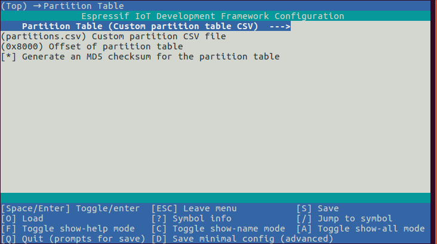
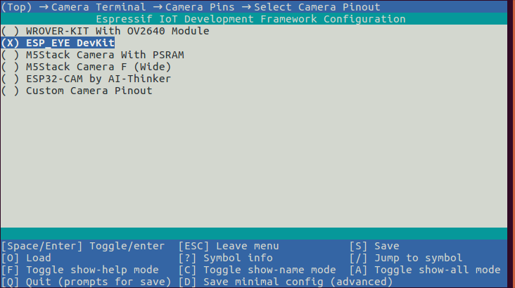
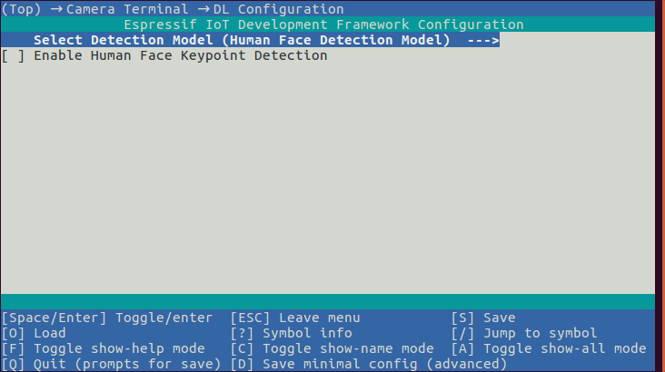
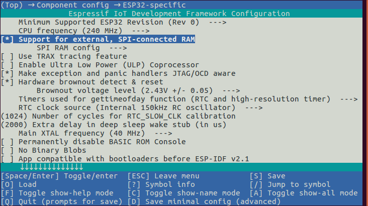
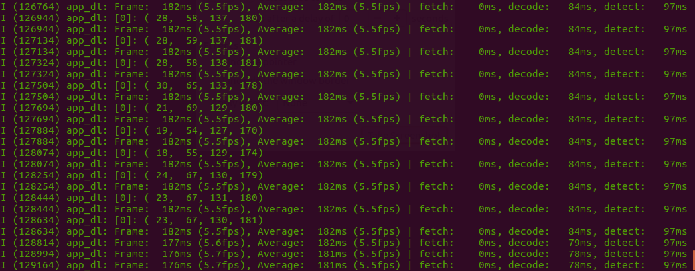

# Camera Terminal[[English](./README.md)]

该示例的输入图片来自摄像头，输出结果打印在终端。该示例演示了以下模型接口在实际项目中的使用情况。

- [HumanFaceDetectMSR01](https://github.com/espressif/esp-dl/blob/master/include/model_zoo/human_face_detect_msr01.hpp)
- [HumanFaceDetectMNP01](https://github.com/espressif/esp-dl/blob/master/include/model_zoo/human_face_detect_mnp01.hpp)
- [CatFaceDetectMN03](https://github.com/espressif/esp-dl/blob/master/include/model_zoo/cat_face_detect_mn03.hpp)


## 硬件要求：

芯片: ESP32，ESP32-S2，ESP32-S3

摄像头: OV2640，OV3660

对于新手，我们为您推荐开发套件：[ESP-EYE](https://www.espressif.com/zh-hans/products/devkits/esp-eye/overview)，ESP-S3-EYE，[ESP32-WROVER-KIT](https://docs.espressif.com/projects/esp-idf/en/latest/esp32/hw-reference/esp32/get-started-wrover-kit-v3.html)


## 示例演示：

如果您完成了硬件准备并已正确安装好摄像头，那我们可以开始软件演示了。

1. 打开终端，并进入当前示例所在目录路经：

    ```shell
    cd ~/esp-who/examples/camera_terminal
    ```

    

2. 设定目标芯片：

    ```shell
    idf.py set-target [SoC]
    ```

    将 [SoC] 替换为您的目标芯片，如 esp32、 esp32s2、esp32s3。

    

3. 打开 menuconfig，设置参数：

   ```shell
   idf.py menuconfig
   ```

   1. 选用自定义分区：

      

      

   2. 选择正确的摄像头管脚配置，下图以 ESP-EYE 为例：

      

      如果您使用的是非官方支持的开发组件，请在 Custom Camera Pinout 中配置正确管脚信息。
      
      
      
   3. 选择您想要运行的模型接口：

      

      

   4. 打开外部 RAM：

      

      

   注意：

   - 每次设定芯片之后，都需要重新设定以上参数。

   - 除了以上参数，用户也可以根据应用场景配置 CPU、Flash等的其他参数。

     

4. 烧录程序，运行 IDF 监视器获取实时结果：

    ```shell
    idf.py flash monitor
    ```

    以步骤 3 中的模型选择为例，打印结果如下所示：

    

    打印结果中包括时间消耗和检测结果。


