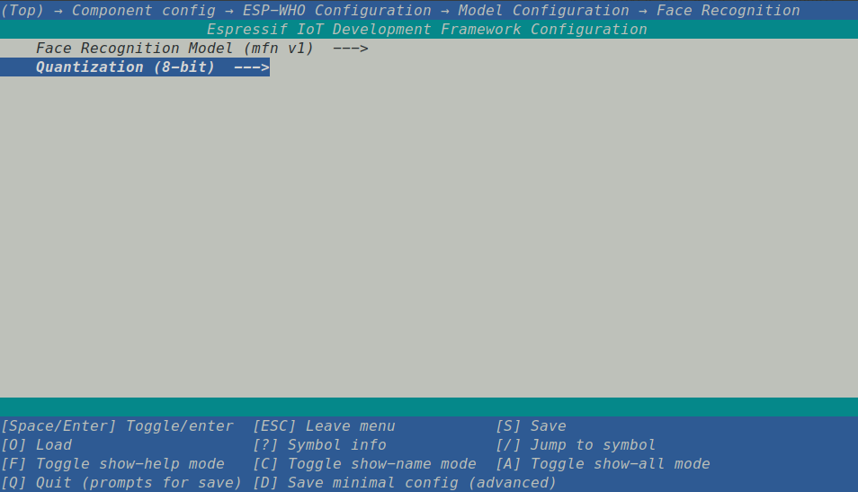

# 人脸识别 [[English]](./README.md)

本示例展示了如何在乐鑫开发板上识别开发板摄像头实时拍到的人脸。该示例的输出结果可显示在 LCD 屏或终端中。

## 运行示例

参考 [ESP-WHO README](../../README_CN.md) 中的步骤，以默认配置运行示例。

## 人脸识别模型配置

若不想使用默认配置，您也可自行配置模型版本和量化方式。

进行 [ESP-WHO README](../../README_CN.md) 中的步骤 4：运行和监视之前，在终端输入 `idf.py menuconfig` ，依次点击 (Top) -> Component config -> ESP-WHO Configuration -> Model Configuration -> Face Recognition 进入下图所示的人脸识别模型配置界面，配置模型版本和量化方式：


您也可以通过在 partitions.csv 里配置 fr 分区的 size 来调节可以存储到 flash 的人脸的个数。
默认的分区大小为 128 K. 您将能看到以下信息：
```
I (1070) MFN: fr partition size: 131072 bytes, maxminum 62 IDs can be stored
```

## 使用示例

您可使用开发板上的 Boot 键交互。

- 短按 Boot 键：识别摄像头实时拍到的人脸。
- 长按 Boot 键：录入摄像头实时拍到的人脸。
- 双击 Boot 键：删除最后一个录入的人脸。
