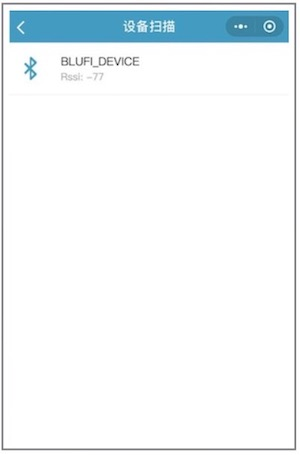
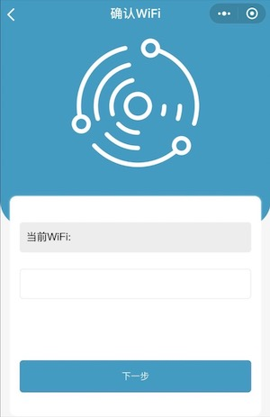

# Face Detection and Recognition using the "ESP EYE" WeChat Mini Program 

This example provides the function of face detection and recognition through a Mini Program called **ESP EYE**, which is developed by Espressif for its AI development board ESP-EYE, on the WeChat platform.

## Overview

WeChat is China's most popular IM (Instant Message) application developed by Tencent, with a user base of more than one billion people. WeChat Mini Programs can be thought of as "sub-applications" within the WeChat ecosystem which provide advanced features to WeChat users, such as e-commerce, task management, coupon services, etc.

To provide an alternative platform to interact with our AI development board ESP-EYE, we have developed the **ESP EYE** Mini Program on the WeChat platform. The **ESP EYE**, when used with a proper ESP32 development board (with a camera interface), provides WeChat users with a series of easy-to-use functions, such as face detection, face recognition, face ID enrollment, and face ID management.

Face detection and recognition using the **ESP EYE** Mini Program has the following advantages: 
* **Intuitive Visual Interface**
* **Customized Face ID Naming** Use your smartphone's keyboard to input Face ID names. Note that only [a-z][A-Z][0-9] characters are supported.
* **No manually IP address entering required!** The Blufi device automatically shares its IP address with the smartphone using the MDNS protocol.

## How to Use this Example

### What You Need

 * An ESP32 development board: An [ESP-EYE](../../../docs/en/get-started/ESP-EYE_Getting_Started_Guide.md) board or other development boards based on ESP32 with a camera interface
 * A smartphone that is equipped with 
    * the WeChat application
    * the Bluetooth function
 * A PC (Windows, Linux, or MacOS)
  
### Step by Step Introduction

1. Download and flash this example to your ESP32 board, following the steps described in [ESP-IDF Getting Started](https://docs.espressif.com/projects/esp-idf/en/stable/get-started/). Please configure the `BT/BLE` and `PSRAM` parameters when compiling the project (You can enable the default configuration easily by using the pre-built `make defconfig` command in your terminal).

2. Launch the WeChat App on your smartphone and go to the **ESP EYE** Mini Program.  

3. Click on the `+` icon to scan nearby BluFi devices. 

	
 
4. Connect the device you want to control by clicking it from the list of scanned nearby BluFi devices, which is the ESP32 development board in this example. Here, the Mini Program will prompt a separated interface, requesting your network configuration. 

	
	
5. Enter the SSID and Password of the network that your smartphone connects to. Note that once configured for BluFi settings, your ESP32 board will store these settings and automatically connect to the previously configured network. To avoid this, please press the **Reset** button on your ESP32 development board for three times in a row.  
	
	

6. Then, the BluFi device connects to the same network with your smartphone. Here, the BluFi shares its IP address to your smartphone using MDNS protocol. After that, you will see the main interface of the **ESP EYE** Mini Program and be able to use the "Face Detection" (the upper left button), "Face Recognition" (the upper right button), "Face ID Enrollment" (the lower left button) and "Face ID Management" (the lower right button) functions by clicking on the corresponding buttons.

	