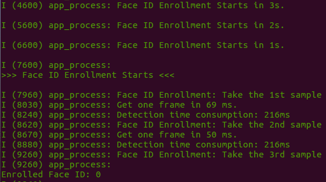
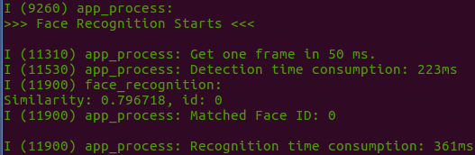

# Face Recognition with Command Line in Single Chip

This example demonstrates **Face Recognition** with a single ESP32 chip (without using any LCD module). ESP32 firstly gets images that are captured by the camera module, then determines if there are any recognized human faces as well as displays its **Recognition Results** in the **Serial Terminal**.

# Preparation

To run this example, you need the following components:

* An ESP32 Module: Either **ESP32-WROVER-KIT** or **ESP-EYE**, which we highly recommend for beginners, is used in this example.
* A Camera Module: Either **OV2640** or **OV3660** image sensor, which we highly recommend for beginners, is used in this example.

# Quick Start

After you've completed the hardware settings, please follow the steps below:

1. **Connect** the camera to ESP32 module. For connection pins, please see [here](../../../docs/en/Camera_connections.md)
2. **Flash Applications** to ESP32;
3. **Start Human Face Detection** and **Check Detection Results**.

## Checking Results

1. Put your camera module away from a human face for at least 0.3 m;
2. Open a Serial Terminal by using the command line `idf.py monitor -p [PORT]`;
3. Once there is a face detecetd, you will be able to see information as displayed in the screenshot below, which indicates the **Face Enrollment** will start soon:

	

### Enrolling a Face ID

To successfully enroll a **Face ID**, ESP32 will collect a certain number of samples of a user's face, which is configurable and 3 by default. To be more specific, by default, ESP32 will collect three samples of a user's face to enroll a new **Face ID**.

### Recognizing a Face ID

After the **Face ID Enrollment**, ESP32 starts the **Face Recognition**.

ESP32 checks if the newly detected face matches any existing **Face ID**, whenever it detects a face:

* If Yes, the Serial Terminal displays the corresponding **Face ID**:

	

* If No, the Serial Terminal displays `No Matched ID`:

	

## Advance Configuration

Users can change the configuration by adjusting some macro definitions specified in the `app_facenet.h` file:

- `ENROLL_CONFIRM_TIMES`: the number of face samples required to enroll one new **Face ID**. By default, this parameter is set to 3, indicating three face samples are required to enroll a new **Face ID**.
- `FACE_ID_SAVE_NUMBER`: the number of **Face IDs** that are allowed to be enrolled. By default, this parameter is set to 1, indicating only one **Face ID** can be stored in the RAM when the system boots up. Users can configure this parameter to a bigger value if they want to enroll more than one **Face ID**. 

Users can also store the enrolled **Face IDs** in the flash of the board, so the existing **Face IDs** won't be lost when the board powers off. To achieve this, please use the following functions, provided in `esp-face`:

- `enroll_to_flash()`: Stores the enrolled **Face IDs** in the flash
- `read_id_from_flash()`: Reads all the enrolled **Face IDs** stored in the flash
- `delete_id_in_flash()`: Deletes the earliest enrolled **Face IDs** stored in the flash

For the detailed description of more parameters for face recognition, please see [Here](https://github.com/espressif/esp-face/tree/master/face_recognition).
