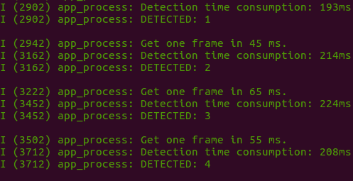

# Camera with Command Line in Single Chip

This example demonstrates **Face Detection** with a single ESP32 chip (without using any LCD module). ESP32 firstly gets images that are captured by the camera module, then determines if there are any human faces as well as displays its **Detection Results** in the **Serial Terminal**. 

# Preparation

To run this example, you need the following components:

* An ESP32 Module: Either **ESP32-WROVER-KIT** or **ESP-EYE**, which we highly recommend for beginners, is used in this example.
* A Camera Module: Either **OV2640** or **OV3660** image sensor, which we highly recommend for beginners, is used in this example.

# Quick Start

After you've completed the hardware settings, please follow the steps below:

1. **Connect** the camera to ESP32 module. For connection pins, please see [here](../../../docs/en/Camera_connections.md)
2. **Flash Applications** to ESP32;
3. **Start Human Face Detection** and **Check Detection Results**.

## Checking Detection Result

1. Put your camera module away from a human face for at least 0.3 meter; 
2. Open a Serial Terminal by using the command line `idf.py monitor -p [PORT]`;
3. Check result at your Serial Terminal, and you will be able to see information displayed in the screenshot below:

 

The keyword **DETECTED** appears whenever ESP32 detects a human face.

## Advance Configuration

In this example, several parameters can be configured by customers to better support different customized scenarios. For the detailed description of these parameters, please see [Here](https://github.com/espressif/esp-face/tree/master/face_detection).

```
    mtmn_config.type = FAST;
    mtmn_config.min_face = 80;
    mtmn_config.pyramid = 0.707;
    mtmn_config.pyramid_times = 4;
    mtmn_config.p_threshold.score = 0.6;
    mtmn_config.p_threshold.nms = 0.7;
    mtmn_config.p_threshold.candidate_number = 20;
    mtmn_config.r_threshold.score = 0.7;
    mtmn_config.r_threshold.nms = 0.7;
    mtmn_config.r_threshold.candidate_number = 10;
    mtmn_config.o_threshold.score = 0.7;
    mtmn_config.o_threshold.nms = 0.7;
    mtmn_config.o_threshold.candidate_number = 1;
```
