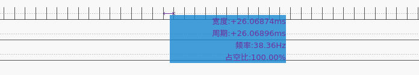

# _LCD_CAM_LOOPBACK_

FPS: 38 Hz



## How to use

* Compile and download

Please unplug the camera module before downloading the code!!!

```bash
idf.py set-target esp32s3beta
idf.py build flash monitor
```