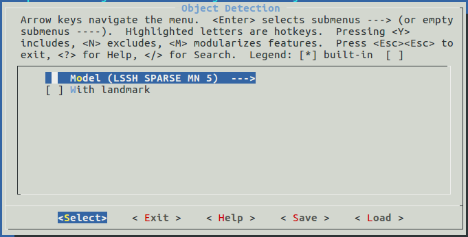

# LSSH

[TOC]

LSSH is a lite one stage Object detection model, which is built around [a new mobile architecture called MobileNetV2](https://arxiv.org/abs/1801.04381) and [SSH: Single Stage Headless Face Detector](https://arxiv.org/abs/1708.03979), and is specially designed for embedded devices.

## API Introduction

```c
lssh_config_t lssh_initialize_config(fptp_t min_face, fptp_t score_threshold, fptp_t nms_threshold, int image_height, int image_width);
```

This `lssh_initialize_config()` helps to set and return a **configuration** of LSSH.

The inputs are:

- **min_face**:
  - Range: [16, the length of the shortest edge of the original input image). 
  - For an original input image of a fixed size, the smaller the `min_face` is, 
    - the larger the number of generated images of different sizes is;
    - the smaller the minimum size of a detectable face is;
    - the longer the processing takes
  - and vice versa.
- **score_threshold**:
	- Range: (0,1)
	- For an original input image of a fixed size, the larger the `score` is,
		- the larger the number of filtered out candidate bounding boxes is
		- the lower the detection ratio is
	- and vice versa.
- **nms_threshold**:
	- Range: (0,1)
	- For an original input image of a fixed size, the larger the `nms` is,
		- the higher the possibility that an overlapped face can be detected is;
		- the larger the number of detected candidate bounding boxes of a same face is
	- and vice versa.
- **image_height**: the height of original input image.
- **image_width**: the width of original input image.

The output is:

- A `lssh_config_t` type value which is the configuration of LSSH.


```c
box_array_t *lssh_detect_object(dl_matrix3du_t *image, lssh_config_t config);
```

This `lssh_detect_object()` handles the whole object detection mission.

The inputs are:

- **image**: an image in `dl_matrix3du_t` type
- **config**: the configuration of LSSH. 

The output is:

- A `box_array_t` type value contains object boxes, as well as score and landmark of each box.

This structure is defined as follows:

```c
typedef struct tag_box_list
{
    fptp_t *score;
    box_t *box;
    landmark_t *landmark;
    int len;
} box_array_t;
```

The structure contains heads of arrays, each array has a same length, which is the number of objects in the image.


```c
void lssh_update_image_shape(lssh_config_t *config, int image_height, int image_width);
```

This `lssh_update_image_shape()` is called before `lssh_detect_object` , when the shape of input image is changeable.

The inputs are:

- **config**: the point to configuration of LSSH.
- **image_height**: the height of original input image.
- **image_width**: the width of original input image.


## Model Selection

Here is only one optional model by now:

- LSSH SPARSE MN 5


### Performance

We evaluated all models with the same configuration and our own test set. The results are shown below.

```c
lssh_config = lssh_initialize_config(80, 0.6, 0.3, 240, 320);
```

|                  | Average Time Consumption (ms)(without/with landmark) |
| :--------------: | :--------------------------------------------------: |
| LSSH SPARSE MN 5 |                        99/105                        |


### How to select

Models can be selected through `idf.py menuconfig` or `make menuconfig`. Select <u>Component config</u> >> <u>ESP-FACE Configuration</u> >> <u>Object Detection</u> sequentially, you'll see options below.



Also, **With landmark** could be selected to enable the landmark output.