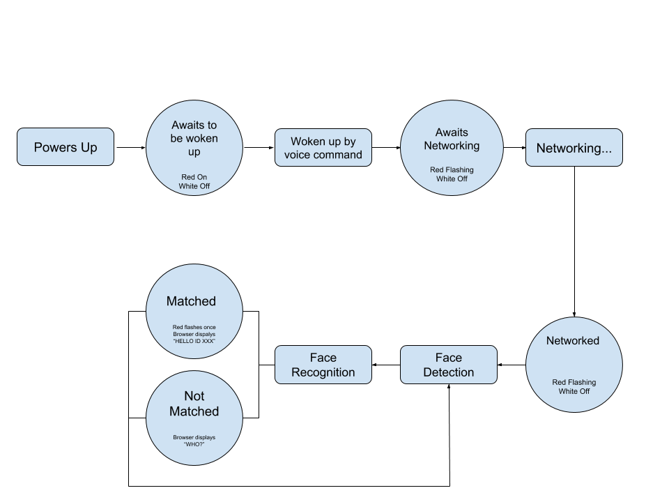
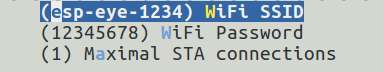
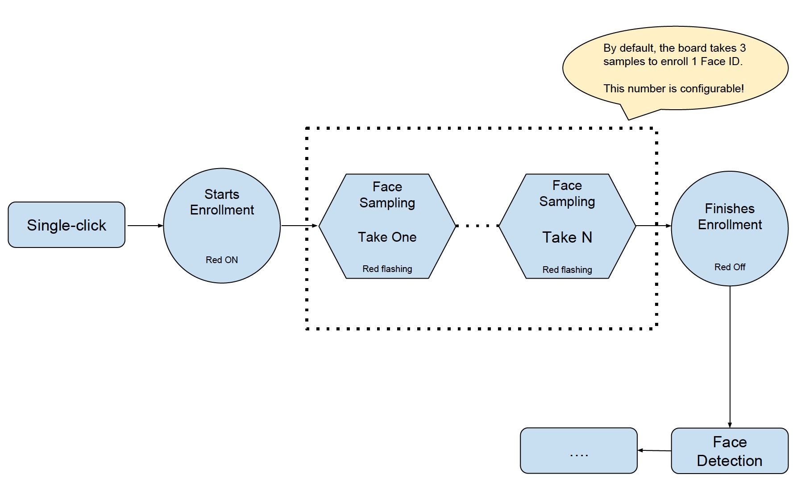

# Face Detection and Recognition with ESP-EYE

This example demonstrates **Face Recognition** and **Voice Wakeup** with ESP-EYE.

For hardware preparation, please see [HERE](../../../docs/en/get-started/ESP-EYE_Getting_Started_Guide.md)

# Key Features

- Voice wakeup
- Face detection
- Face recognition

# Key Process

The figure below describes the workflow of ESP-EYE:

#### 1. Voice Wake-up 

ESP-EYE awaits to be woken up after powering up (Red LED on and white LED off). The board wakes up after recognizing the wake-up command "Hi Lexin" ([Ləsɪ:n]), and then awaits for networking (Red LED flashing and white LED off). Subsequently, users can initiate the networking.

>Note: If you want to download an audio clip of our wake-up command "Hi Lexin", please click [here](https://dl.espressif.com/dl/Hi_Lexin_wake-up_commend.wav).

#### 2. Networking

Users can connect their PCs or mobile phones to ESP-EYE's Wi-Fi (by default), with the following information:

- Username: esp-eye-xxxx (xxxx should be the board's MAC address)
- Password: not needed

Alternatively, users can also follow the steps below to configure the username and password of the board's Wi-Fi connection:

- Launch your Terminal.
- Run `make menuconfig` and complete the configuration, as instructed in the figure below:
	
	

> Note: After reconfiguring the Wi-Fi username and password, you will have to restart from the point of downloading firmware.

#### 3. Face Detection

ESP-EYE starts the face detection after networking. Users can see the real-time image captured by the board, through their browser (address: `192.168.4.1/face_stream`). During this step, the red LED is off and the white LED is on.

#### 4. Face Recognition

After detecting a face, ESP-EYE will start the face 
recognition if there are any enrolled Face IDs stored in the board:

- When there is a match, the red LED on the board flashes once and the browser displays **HELLO ID XXX**.
- When there is no match, the board shows no signs and the browser displays **WHO?**.

If there is no enrolled Face ID, the board continues the face-detecting process. You should enroll at least one Face ID if you want to start face 
recognition.

#### 5. Add/delete a Face ID

The users can add/delete a Face ID after the network is successfully established.

##### 5.1 Add a Face ID

- Single-click the Side Tactile Button to enroll a new Face ID. At this point, the red LED is on and the browser displays **START ENROLLING**;
- Once you put a face in front of the camera, the face-sampling starts automatically. The red LED flashes whenever the board gets a face sample and the browser displays the ordinal number of the current face sample, i.e. **THE 1st SAMPLE** etc. By default, the board has to take three samples to add one Face ID. Users can configure the number of samples needed for one Face ID. (Please adjust your position/distance from the camera and try again if you cannot see the red LED flashing for some time).
- After the Face ID enrollment, the red LED on the board is off and the browser displays **ENROLLED FACE ID XXX**;
- The board enters Face Detection after the Face ID enrollment.

Currently, ESP-EYE can enroll up to 10 Face IDs. Please note that the maximum number of enrolled Face IDs can be configured according to how users allocate the flash memory. However, we recommend a number that is no greater than 30.

##### 5.2 Delete a Face ID

- Double-click the Side Tactile Button to delete an existing Face ID.
- After that, the board deletes the earliest record of all the existing enrolled Face IDs. The white LED on the board flashes, and the browser displays: **XXX ID(S) LEFT**.

#### Troubleshooting

The board returns to the "awaiting to be woken up" status when there are network anomalies, such as "network disconnection" and "network timeout".
