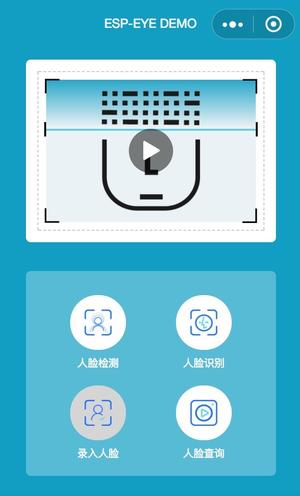

# Example for Wechat App

This is an example of face recognition at Wechat platform. You need to access the app then get the complete experience.

## Overview

Like other examples in this repository, this is the face recognition demo via wechat app. The basic connection protocol between the board and the phone is HTTP. Instead of typing some IP address or command through web browser, we encapsolute those commands into some simple buttons, and display the image and result in a proper layout. In order to get the right IP address automatically, we implement BluFi to lead connecting to the LAN, and then use MDNS to get its IP address. In addition, with the help of phone keyboard, we can register our face id with a proper name(only support [a-z][A-Z][0-9]), query enrolled face ids, and delete one.

## Pre-request
 * [ESP-EYE](../../../docs/en/get-started/ESP-EYE_Getting_Started_Guide.md) board or other ESP32-series boards with camera interface
 * Access to Wechat app.
 * Make your phone connected to a Router or AP. Because we need the connection in Local Area Nerwork(LAN).
 * Make your phone bluetooth enable.

## Walk through

 1. Download the program to the board. There is one thing to mention, when compiling the project, remember to make BT/BLE enable and PSRAM enable. To simplify this step, please do `make defconfig` to replace some default configuration.

 2. Open the Wechat App, now there is no STA available to notify. So press icon `+` to search and pair BluFi device. 
 
 3. Connect the device. Then it will prompt a new page to configure the network. Fill the SSID and Password of the network which your phone is connecting to.

 4. Now you should notice that the board has been connected to the same network. Through notifying with the board, the page will automatically find the current IP and enter to a new page.

 5. In this page, you will have some buttons and one fixed window. Press the button in the middle of the window, then enjoy yourself!

## Complementary

 Once the BluFi of the board is configured. it will remember the settings, and will automatically connect to the network. If you want to reset the BluFi, you need to fast reset the board 3 times. Then the information will be cleared.

